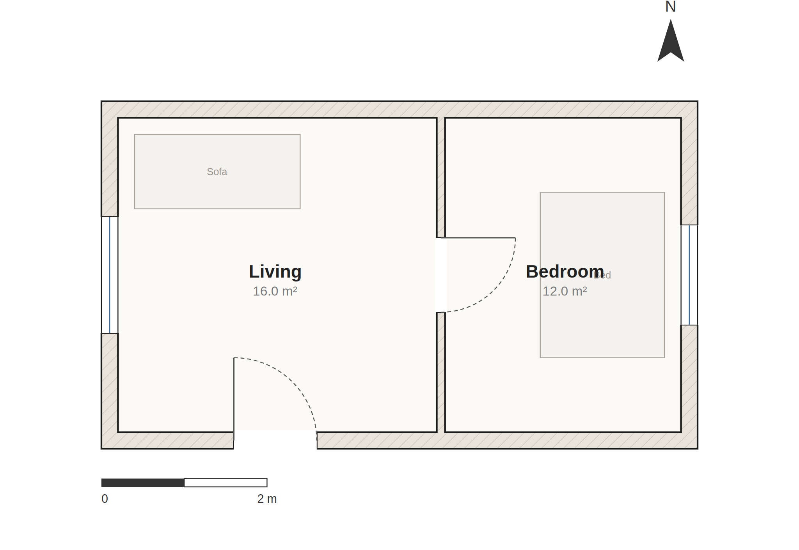
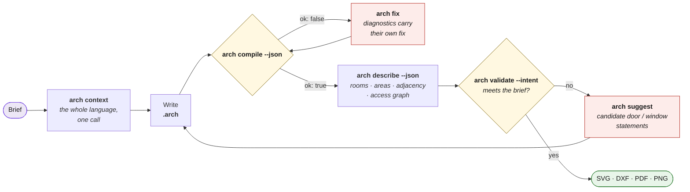
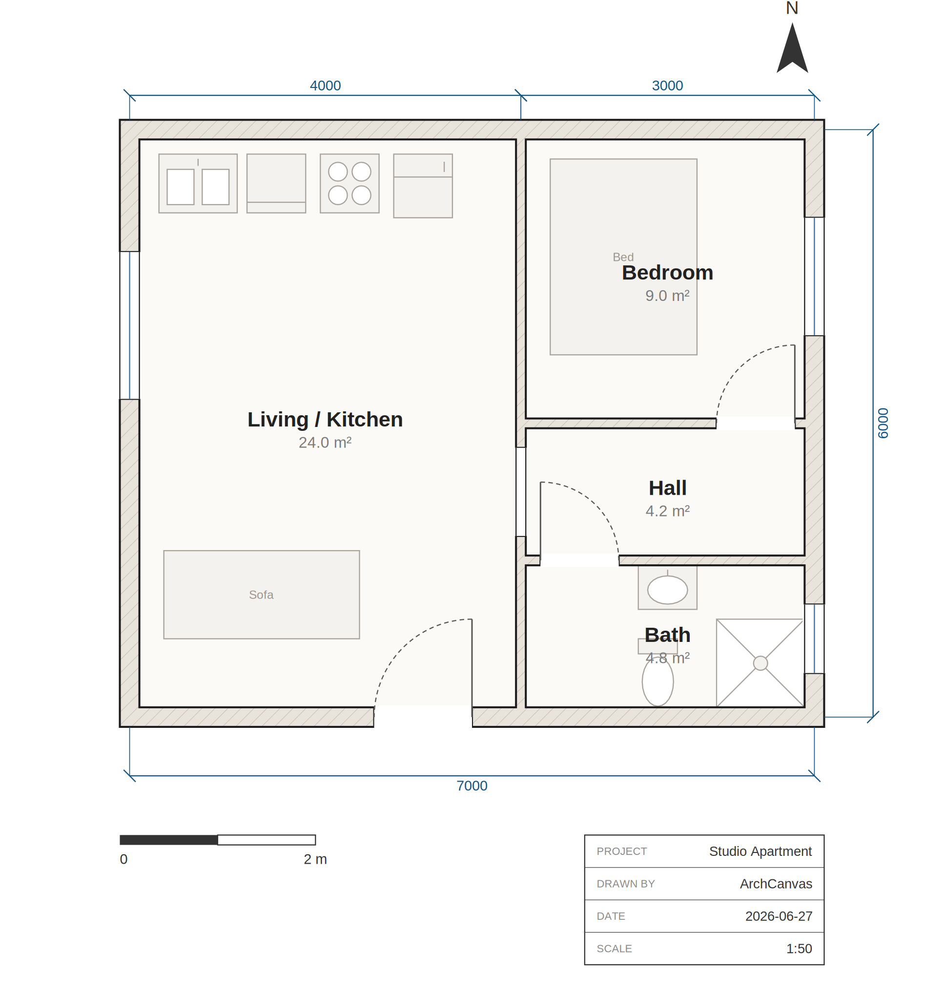
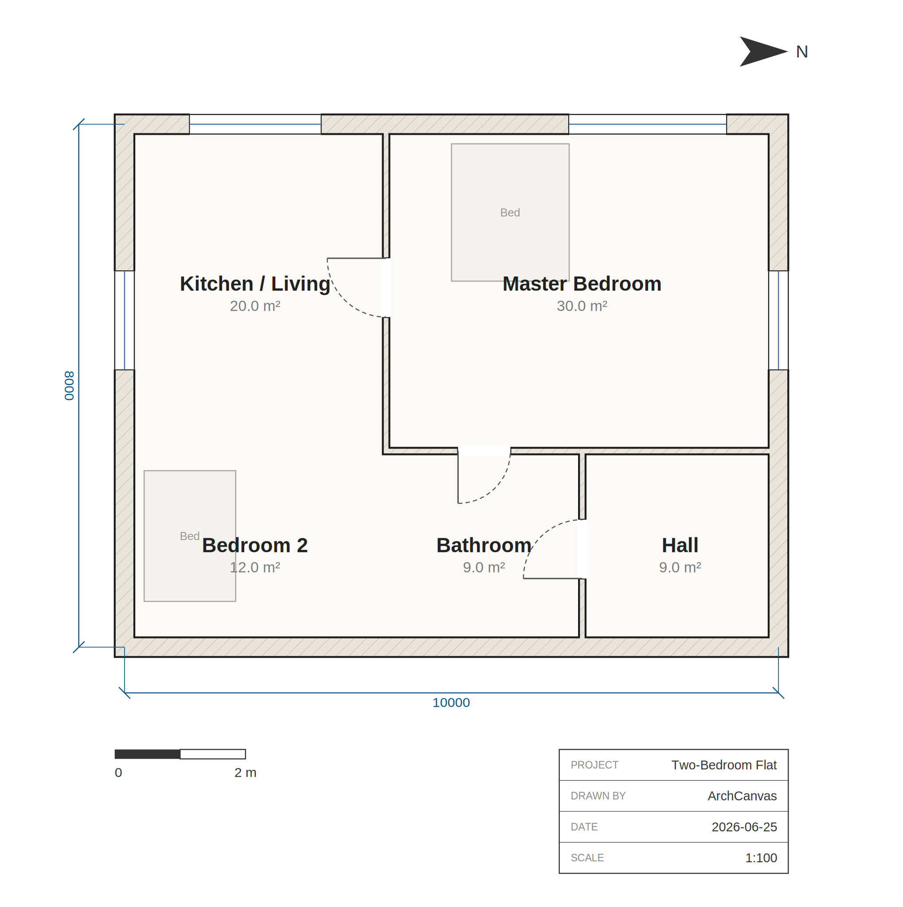
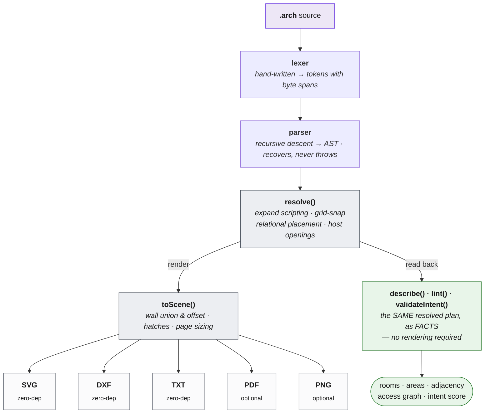

<!-- AGENT-FIRST NOTICE -->
> [!IMPORTANT]
> ### 🤖 Read this with your AI agent — don't read it by hand.
> This repo is written agent-first. Point Claude Code, GitHub Copilot, Cursor, or any agent at it:
> *"Read the README and AGENTS.md, then help me run / extend this."*
> Structure + [`AGENTS.md`](AGENTS.md) are optimized for agent comprehension.
<!-- /AGENT-FIRST NOTICE -->

<div align="center">

<picture>
  <source media="(prefers-color-scheme: dark)" srcset="./brand/archlang-wordmark.svg" />
  
</picture>

### Floor plans as code — like Typst/LaTeX, but for architecture.

**Text in, a precise architectural drawing out.** Deterministic, zero-dependency,
and built so an **AI agent can verify its own plan without ever looking at an image**.

[](https://www.npmjs.com/package/@chanmeng666/archlang)
[](https://github.com/chanmeng666/archlang/actions/workflows/ci.yml)
[](https://nodejs.org)
[](#-why-it-is-different)
[](LICENSE)
[](https://github.com/chanmeng666/archlang/stargazers)
[](https://github.com/sponsors/ChanMeng666)

**[▶ Live Playground](https://archlang-playground.vercel.app)** · **[📖 Docs](https://archlang-docs.vercel.app)** · **[⌨ CLI reference](https://archlang-docs.vercel.app/cli)** · **[📦 npm](https://www.npmjs.com/package/@chanmeng666/archlang)** · **[🧩 VS Code](https://marketplace.visualstudio.com/items?itemName=ChanMeng.archlang)**

</div>

## 👀 See it

This is the whole program on the left, and **the actual drawing it compiles to** on the right —
not a mock-up. Walls join and hatch themselves, the door draws its own swing arc, the window
draws its glazing, and the furniture is placed by *anchor*, never by hand-computed coordinates.

<table>
<tr>
<td width="52%" valign="top">

```arch
plan "Attached 1BR" {
  units mm
  grid 100
  north up

  strip right at (0,0) gap 0 height 4000 {
    room id=r_living size 4000 label "Living"  uses living
    room id=r_bed    size 3000 label "Bedroom" uses bedroom
  }

  wall id=w_north exterior  thickness 200 { (0,0) (7000,0) }
  wall id=w_south exterior  thickness 200 { (0,4000) (7000,4000) }
  wall id=w_west  exterior  thickness 200 { (0,0) (0,4000) }
  wall id=w_east  exterior  thickness 200 { (7000,0) (7000,4000) }
  wall id=w_part  partition thickness 100 { (4000,0) (4000,4000) }

  door id=d_main on w_south at 2000 width 1000 hinge near start swing into r_living
  door id=d_bed  on w_part  at 2000 width 900  swing into r_bed

  window on w_west at 50% width 1400
  window on w_east at 50% width 1200

  furniture sofa in r_living anchor top-left inset 300 size 2000x900  label "Sofa"
  furniture bed  in r_bed    anchor right    inset 300 size 1500x2000 label "Bed"
}
```

</td>
<td width="48%" valign="top">



</td>
</tr>
</table>

> ▶ **[Open this in the playground](https://archlang-playground.vercel.app)** and edit it live — the
> compiler runs in your browser, nothing is sent to a server. Source:
> [`examples/attached.arch`](examples/attached.arch).

## 🌟 Introduction

**ArchLang** is a small declarative language for floor plans. You *declare* a plan — walls, rooms,
doors, windows, furniture — and the compiler renders a clean, professional **SVG** (also DXF, PDF,
PNG, and a zero-dependency ASCII plan).

Coordinates are integer **millimetres**, so output is **deterministic**: the same source always
produces byte-identical bytes, and changing one number changes exactly one thing. *"Make the bedroom
1 m wider"* is a one-number diff — not a re-roll of a raster image that silently redraws the kitchen
too.

The compiler is **pure TypeScript with zero runtime dependencies** and is isomorphic — the same code
runs in Node and in the browser, which is why the [playground](https://archlang-playground.vercel.app)
is fully client-side.

> ArchLang is the floor-plan engine behind [ArchCanvas](https://github.com/chanmeng666/archcanvas),
> an AI design agent — but it stands alone and is useful in any app or script.

## 💡 Why it is different

Most "AI floor plan" tools generate a **picture**. A picture cannot be checked, diffed, or reasoned
about — and neither the model nor you can tell whether the bathroom is actually reachable.

ArchLang generates a **program**, and then lets you interrogate it as **facts**:

| | Raster image generation | **ArchLang** |
|---|---|---|
| Output | pixels | a `.arch` program → SVG / DXF / PDF / PNG / TXT |
| Edit "widen the bedroom" | re-roll the whole image | change one number |
| Same input twice | different image | **byte-identical** output |
| "Is the bath reachable?" | look at it and guess | `arch describe --json` → access graph |
| "Does it match the brief?" | eyeball it | `arch validate --intent` → exit code |
| Wrong syntax | — | **errors returned as data, each carrying its own `fix`** |

That last row is the whole design: **`compile()` never throws.** It *returns* `diagnostics` with byte
spans and a machine-applicable fix, which is what makes a tight self-correction loop possible.

## 🤖 The agent loop

An agent can author a plan, correct itself, and **confirm the plan matches the brief without
rendering an image at all** — which is what makes ArchLang cheap to drive from a text-only model.



**Cold start in one command.** `arch context` prints the entire agent context — language spec,
workflow skill, CLI reference and every diagnostic code — as one system-prompt-ready document (the
same [`llms-full.txt`](https://archlang-docs.vercel.app/llms-full.txt) the docs site serves).

```bash
npx @chanmeng666/archlang context                       # EVERYTHING: spec + skill + CLI + error catalog
npx @chanmeng666/archlang spec                          # just the language, one page (~2k tokens)
npx @chanmeng666/archlang compile plan.arch --json      # render → { ok, diagnostics, summary }
npx @chanmeng666/archlang fix plan.arch --dry-run       # preview the machine-applicable fixes
npx @chanmeng666/archlang describe plan.arch --json     # VERIFY, without an image
npx @chanmeng666/archlang validate plan.arch --strict   # the ship gate
```

Every command takes `--json` (result on stdout, messages on stderr) with deterministic exit codes
(`0` ok · `2` user-source error · `1` IO · `3` usage). Full list: **[CLI reference](https://archlang-docs.vercel.app/cli)**
· `arch manifest --json` returns the same thing as data. See [`SKILL.md`](SKILL.md).

<details>
<summary><b>Machine-native artifacts</b> — Plan JSON, a GBNF grammar, an intent schema, and an optional MCP server</summary>

<br/>

| Artifact | Use |
|---|---|
| [`/plan.schema.json`](https://archlang-docs.vercel.app/plan.schema.json) | Emit structured JSON, compile it with `arch compile --from-json` |
| [`/archlang.gbnf`](https://archlang-docs.vercel.app/archlang.gbnf) | Constrain a local model to parseable output |
| [`/intent.schema.json`](https://archlang-docs.vercel.app/intent.schema.json) | Write the brief down as a contract; gate on it with `validate --intent` |
| [`/llms-full.txt`](https://archlang-docs.vercel.app/llms-full.txt) | The whole context bundle (`arch context`) |

**MCP server (optional).** [`@chanmeng666/archlang-mcp`](packages/mcp) is a stdio Model Context
Protocol shim over the library, listed on the official registry as `io.github.ChanMeng666/archlang-mcp`:

```bash
claude mcp add archlang -- npx -y @chanmeng666/archlang-mcp
```

Prefer the **CLI** when your agent has a shell — a CLI costs nothing in the context window until it
is called, whereas an MCP tool schema sits there permanently. The server exists so MCP-native hosts
can *discover* ArchLang. The core stays zero-dependency; the SDK lives only in that package
([ADR 0012](docs/adr/0012-mcp-shim-discoverability.md)).

**In CI:** [`.github/actions/arch-render`](.github/actions/arch-render) renders every ` ```arch `
fence in your Markdown to images in one step.

</details>

## ✨ Features

<details open>
<summary><b>It draws like an architect, not like a plotter</b></summary>

<br/>

Poché-hatched walls (by material), door **swing arcs**, window glazing, computed room areas,
dimension lines, layers, line weights, a north arrow, a scale bar and a title block. Real **fixture
symbols** for WC, basin, shower, bathtub, sink, counter, fridge and stove — plus `dims auto` to
synthesize dimension strings for you.

</details>

<details>
<summary><b>It checks architectural soundness, not just syntax</b></summary>

<br/>

`arch lint` encodes tacit professional knowledge: a bathroom reachable only *through* a bedroom, a
wet room that isn't fully walled in, a door whose swing hits furniture or another door, a windowless
bedroom, an unenterable room, a too-narrow door, a bath/kitchen with no fixtures, and a room whose use
was merely *inferred* from an indirect label (`W_ALIAS_MATCH` — with a fix that pins the explicit
`uses`). All tunable via the ruleset.

</details>

<details>
<summary><b>It models how a person actually walks the plan</b></summary>

<br/>

`arch describe` runs a clearance-eroded nav grid: per-room walk distance, the **narrowest pinch on
the way in**, and how circuitous the route is — with advisory lint for a too-tight
(`W_PATH_TOO_NARROW`) or roundabout (`W_CIRCUITOUS_PATH`) walk, and an opt-in
`arch compile --overlay circulation` that draws the routes on top of the plan.

**Facts and advice — never an invisible auto-arranger** ([ADR 0005](docs/adr/0005-no-invisible-architect.md)).
`arch repair` is the one *explicit* corrector: it pushes furniture out of walls, doorways and swing
arcs, and emits a change log you review.

</details>

<details>
<summary><b>Errors are data, and many carry a machine-applicable fix</b></summary>

<br/>

`compile()` **never throws** on bad source — it *returns* `diagnostics` with byte spans, a catalogued
`E_*`/`W_*` code, and a `fix`. Where the edit is mechanical, the diagnostic also carries applicable
`fixes` that `arch fix` applies for you. `--error-svg` even turns a plan that *won't* compile into a
self-describing error card an agent can look at.

</details>

<details>
<summary><b>Parametric, scriptable, and still deterministic</b></summary>

<br/>

Values, arithmetic, arrays, `for`/`if`/`while` and pure functions — plus **relational placement**
(`right-of` / `below` / …) and room **strips**, resolved by deterministic topological arithmetic, not
an optimizer. All of it expands at compile time: no runtime, no clock, no I/O. Optional metric unit
suffixes (`4m` / `40cm` / `20mm`) fold exactly to millimetres at lex time.

</details>

<details>
<summary><b>Five output formats · accessible SVG · IDE-grade tooling</b></summary>

<br/>

**SVG**, **DXF** and a **TXT** ASCII plan with zero dependencies; **PDF** (vector, selectable text)
and **PNG** (deterministic raster) via optional, lazily-loaded add-ons the default install never
pulls. `arch compile --accessible` stamps the SVG with `<title>`/`<desc>` + `role="img"`.

A full **LSP** (hover, completion, go-to-definition, rename, signature help), an `arch fmt`
formatter, an `arch explain <CODE>` catalog, and a [VS Code extension](https://marketplace.visualstudio.com/items?itemName=ChanMeng.archlang).

</details>

## 🚀 Quick start

```bash
npx @chanmeng666/archlang new -o plan.arch          # scaffold a starter plan
npx @chanmeng666/archlang compile plan.arch -o plan.svg
```

Or install it:

```bash
npm install @chanmeng666/archlang
```

**As a library** (zero dependencies, runs in Node *and* the browser):

```ts
import { compile } from "@chanmeng666/archlang";

const { svg, diagnostics } = compile(`
plan "Tiny" {
  units mm
  grid 50
  wall exterior thickness 200 { (0,0) (4000,0) (4000,3000) (0,3000) close }
  room id=r at (0,0) size 4000x3000 label "Studio"
  door at (2000,3000) width 900 wall exterior hinge left swing in
  window at (0,1500) width 1200 wall exterior
}`);

// compile() never throws — errors come back as data, each with a span and a fix.
if (diagnostics.some((d) => d.severity === "error")) console.error(diagnostics);
else writeFileSync("tiny.svg", svg);
```

**Also exported, all pure:** `describe()` (facts), `lint()` (soundness), `validateIntent()` +
`projectSubscores()` (does it match the brief?), `repair()`, `applyFixes()`, `suggestTopology()`,
`renderAscii()`, `toDxf()`, and the LSP core (`completion`, `hover`, …).

<details>
<summary><b>Develop this repo</b></summary>

<br/>

```bash
npm install          # one install bootstraps every workspace
npm run build        # build the library + CLI into dist/
npm run check        # typecheck + lint + the full test suite
npm run check:drift  # every generated artifact must match its source
npm run playground:dev   # build the core, then open the playground
```

</details>

## 🖼️ Gallery

Every one of these is a real, compiled example from [`examples/`](examples) — click through to the
source.

<table>
<tr>
<td width="33%" align="center" valign="top">
<a href="examples/studio.arch"></a><br/>
<b><a href="examples/studio.arch">studio</a></b><br/>
<sub>The flagship: fitted kitchen & bath,<br/>enclosed bath off a central hall.<br/><b>Lint-clean.</b></sub>
</td>
<td width="33%" align="center" valign="top">
<a href="examples/two-bed.arch"></a><br/>
<b><a href="examples/two-bed.arch">two-bed</a></b><br/>
<sub>A larger plan: central corridor,<br/>multiple rooms and openings.</sub>
</td>
<td width="33%" align="center" valign="top">
<a href="examples/attached.arch"></a><br/>
<b><a href="examples/attached.arch">attached</a></b><br/>
<sub>No hand-computed coordinates:<br/>strips, on-wall openings, anchors.</sub>
</td>
</tr>
</table>

Also in [`examples/`](examples): `parametric` (a `for` loop that generates units), `themed` (a custom
theme + brick hatch), `relational` (`right-of` / `below`), and `accessible` (`accTitle`/`accDescr`).
The [docs gallery](https://archlang-docs.vercel.app/examples) renders all of them **live and
editable** in the browser.

## 🏗️ How it works

ArchLang is a compiler pipeline. Source text becomes a backend-neutral **Scene IR**, and every
backend is a pure serializer of that scene — which is why adding a format never touches the language.



The dotted branch is the point: **`describe`, `lint` and the intent check read the same resolved
plan the renderer does** — so what an agent verifies is exactly what gets drawn, and it costs no
pixels to check.

`compile()` is **pure, synchronous and deterministic** — no I/O, no `Date.now()`, no `Math.random()`.
The only place Node APIs are allowed is the CLI; everything else gets its environment through a
`World` seam. See [AGENTS.md](AGENTS.md) and the [ADRs](docs/adr).

## 📦 Ecosystem

| Package / surface | What it is |
|---|---|
| **[`@chanmeng666/archlang`](https://www.npmjs.com/package/@chanmeng666/archlang)** | The core: compiler, CLI, analysis. Zero runtime deps, isomorphic. |
| **[`@chanmeng666/archlang-mcp`](packages/mcp)** | Optional stdio MCP server (the SDK is quarantined here). |
| **[VS Code extension](https://marketplace.visualstudio.com/items?itemName=ChanMeng.archlang)** | Syntax + live diagnostics, hover, completion, rename. |
| **[Playground](https://archlang-playground.vercel.app)** | Client-side editor: preview, describe, lint, **intent scoring**, apply-fix, embed. |
| **[Docs site](https://archlang-docs.vercel.app)** | Guide, reference, [CLI reference](https://archlang-docs.vercel.app/cli), ADRs, live examples. |
| **[🤗 Dataset](https://huggingface.co/datasets/ChanMeng666/archlang-repair-trajectories)** | Synthetic, self-verifying **repair trajectories** + authoring pairs. CC0. |
| **[GitHub Action](.github/actions/arch-render)** | Render ` ```arch ` fences in any repo's Markdown. |

### Embed a plan anywhere

A live, self-contained plan in any blog or wiki — one `<iframe>`, no build step, nothing sent to a
server (the source rides in a compressed hash):

```html
<iframe src="https://archlang-playground.vercel.app/embed.html#z=…" width="720" height="480"></iframe>
```

The playground's **Embed** button generates it. Optional params: `editable=1`, and
`theme=blueprint|dark|mono|presentation`.

## 📚 Documentation

- **[📖 Docs site](https://archlang-docs.vercel.app)** — guide, reference, error catalog, ADRs, and a **live, editable** examples gallery. Every ` ```arch ` fence on a docs page is itself an editable plan.
- **[⌨ CLI reference](https://archlang-docs.vercel.app/cli)** — every command, flag and exit code (generated from the manifest, so it can't fall behind).
- **[spec.llm.md](spec.llm.md)** — the **whole language in one page** (~2k tokens) for AI agents; also `arch spec`.
- **[SKILL.md](SKILL.md)** — the agent Skill: the `spec → compile → fix → describe → validate` loop.
- **[Language Reference](docs/language-reference.md)** · **[Error catalog](docs/error-codes.md)** · **[The intent contract](docs/intent.md)** · **[ADRs](docs/adr)**
- **[AGENTS.md](AGENTS.md)** — orientation for AI agents working *in* this repo.

## 🤝 Contributing

Contributions are welcome! Please read the [Contributing Guide](CONTRIBUTING.md) and our
[Code of Conduct](CODE_OF_CONDUCT.md). Use the issue and pull-request templates when you open one.

## ❤️ Support & Sponsor

- Questions? Open a [Discussion](https://github.com/chanmeng666/archlang/discussions) or see [SUPPORT.md](SUPPORT.md).
- Found a security issue? Follow [SECURITY.md](SECURITY.md).
- If this project helps you, consider [sponsoring](https://github.com/sponsors/ChanMeng666) ☕.

## 📄 License

Released under the [MIT](LICENSE) license.

---

<!-- CHAN MENG PERSONAL BRAND -->
<div align="center">
  <a href="https://github.com/ChanMeng666" target="_blank">
    
  </a>

  <p><strong>Chan Meng</strong><br/>Need a custom app like this one? I build them — let's talk.</p>

  <a href="mailto:chanmeng.dev@gmail.com"></a>
  <a href="https://github.com/ChanMeng666"></a>
</div>
<!-- /CHAN MENG PERSONAL BRAND -->
