<!-- AGENT-FIRST NOTICE -->
> [!IMPORTANT]
> ### 🤖 Read this with your AI agent — don't read it by hand.
> This repo is written agent-first. Point Claude Code, GitHub Copilot, Cursor, or any agent at it:
> *"Read the README and AGENTS.md, then help me run / extend this."*
> Structure + [`AGENTS.md`](AGENTS.md) are optimized for agent comprehension.
<!-- /AGENT-FIRST NOTICE -->

<div align="center">

<picture>
  <source media="(prefers-color-scheme: dark)" srcset="./brand/archlang-wordmark.svg" />
  
</picture>

### Floor plans as code — like Typst/LaTeX, but for architecture.

**Text in, a precise architectural drawing out.** Deterministic, zero-dependency,
and built so an **AI agent can verify its own plan without ever looking at an image**.

[](https://www.npmjs.com/package/@chanmeng666/archlang)
[](https://github.com/chanmeng666/archlang/actions/workflows/ci.yml)
[](https://nodejs.org)
[](#-why-it-is-different)
[](LICENSE)
[](https://github.com/chanmeng666/archlang/stargazers)
[](https://github.com/sponsors/ChanMeng666)

**[▶ Live Playground](https://playground.archlang.uk)** · **[📖 Docs](https://archlang.uk)** · **[⌨ CLI reference](https://archlang.uk/cli)** · **[📦 npm](https://www.npmjs.com/package/@chanmeng666/archlang)** · **[🧩 VS Code](https://marketplace.visualstudio.com/items?itemName=ChanMeng.archlang)**

</div>

## 👀 See it

Here is a **whole program**, and below it **the actual drawing it compiles to** — not a mock-up.
Not one coordinate in it places a door, a window or a piece of furniture: every opening is pinned to
a distance along a *named wall*, every fixture resolves against a room or a wall, and the bath and
bedroom are laid out by a `strip`. `site { street north }` names the two facades the plan turns
on — the front door faces the lane, the glazing faces the garden.

```arch
# A one-bedroom laneway cottage — 49 m² that reads as one program.
#
# Nothing here is positioned by hand. Every opening is pinned to a run distance along a
# named wall (`on <wall> at <pos>`), every fixture resolves against a room or a wall
# (`in <room> anchor …`, `against wall …`), and the bath/bedroom pair is laid out by
# `strip`. `site { street north }` names the two facades the plan turns on: the door
# faces the lane, the glass faces the garden.
plan "Laneway House" {
  units mm
  grid 50            # partitions are 100 thick, so a `flush` fixture lands on a …50
  north up
  dims auto all
  site { street north }

  wall id=w_lane   exterior  thickness 200 { (0,0) (7500,0) }
  wall id=w_east   exterior  thickness 200 { (7500,0) (7500,6500) }
  wall id=w_garden exterior  thickness 200 { (0,6500) (7500,6500) }
  wall id=w_west   exterior  thickness 200 { (0,0) (0,6500) }
  wall id=w_hall   partition thickness 100 { (4200,0) (4200,6500) }
  wall id=w_bath   partition thickness 100 { (4200,2500) (7500,2500) }

  room id=r_live at (0,0) size 4200x6500 label "Living / Kitchen" uses living kitchen
  strip down at (4200,0) gap 0 width 3300 {
    room id=r_bath size 2500 label "Bath"    uses bath
    room id=r_bed  size 4000 label "Bedroom" uses bedroom
  }

  door id=d_front  on w_lane at 2100 width 900 hinge near start swing into r_live
  door id=d_garden sliding on w_garden at 2700 width 1800 slide left
  door id=d_bed    on w_hall at 5600 width 800 hinge left swing into r_bed
  # `w_hall` is walked lane→garden, so `slide right` sends the panel down the solid wall
  # below the jamb; `slide left` would aim it at 500 mm and trip `W_POCKET_RUN`.
  door id=d_bath   pocket on w_hall at 900 width 800 slide right

  window on w_west   at 2400 width 1200
  window on w_garden at 700  width 1000
  window on w_garden at 5850 width 1600
  window on w_east   at 1500 width 600

  furniture fridge       against wall w_west offset 400  in r_live
  furniture stove        against wall w_west offset 1200 in r_live
  furniture kitchen_sink against wall w_west offset 2000 in r_live
  furniture table  in r_live centered size 1300x900 label "Table"
  furniture sofa   in r_live anchor bottom-left flush inset 250 size 900x2000  label "Sofa"
  furniture bed    in r_bed  anchor bottom-right flush inset 250 size 1500x2000 label "Bed"
  furniture robe   in r_bed  anchor top-left     flush inset 200 size 1800x600  label "Wardrobe"
  furniture shower in r_bath anchor top-right    flush size 900x900
  furniture wc     in r_bath anchor bottom-left  flush size 400x700
  furniture basin  in r_bath anchor bottom-right flush size 600x450

  title { project "Laneway House" drawn_by "ArchLang" date "2026-08-16" }
}
```

<div align="center">

<a href="https://playground.archlang.uk/#z=jZZfbhs3EMbf9xQfpBcHsB1asRy7TQKkRYACMdKiTZFH7aw40jJekQJJeeUGBvLUAxQ9Qw_QI_QoOUkx5EpaObZbPVGrmR-_-bsa4jWc5aOKtXdugYYst3SDqYuR5owvn__E6QUW__yNWFOEZ9IBFMQJS-_mnhbHxbAY4p2LtbFz1OwZJmDpgonGWdaoblCT1cd4c83-Bm7JVizFyFgxiA4Ev7LQJkSyUwY1zs5BxRCWFqzRUtPgoHQWL-T4ChTxYunCq_LJIThhZ2YdV57hObjmmgNoTsaGKGgJzXlQ4hRDHJTG4oU8fgWy09p5fPn8V3mIcuOULpRnTw5BViPWjIpi_XSTqSUZLyE0ZDTcKqK6KYYoQ_RmWR6jDCYyPiFEzxxhnY81bssUTki02DrMaEq6-75syCKuvJXkfpMeaed8MRSrzkbKc5hO84ZC6P0yJ6_ZHheJMrjsyviDWwUe4FMBrKyJAYtFAcy90Rgr9D5DLMnHVLAA8owTpRBrM706RJDqlLNmFepym-WGrBahIMnSWBXoYlwtC0CbRQCtpK5NUwD3JqMokNNs9Mt2IqEB4HVkb5xHvt1yCBgphU84UIfqCQ6ej1U63O55M4X4uPfGLx_OxuorRk7h4wqy38OMlv9LRxZxv3ctJ-xK0fM-yd6noy6KdLiPIU36PxijXiCjDlMgT4rRL_2kMdcsU5YFB_MbQxzXcicaqrjB4NJcyyA_xVsTpzXbAVaBA5r8-Co_lPLLUEC71ibiJog5LaHQGh1rPHsm4grpxZ2GFEu6etS79TuK9UAM02Vic9eNNTrFqueWB7fT2I1xgRy3TJo468nMOxshnd31JEWMJHNZ54VSkD3HsEweIZKPCG3aZzY65MTtEbu-Co3RYpbI3TNhP9-yT86VSmaMhmdxD5Ji6mSlNqGI8dnW9XwrSzz3BVWsC5nwMnuWsrVaaq5Yp33y5fc_spo06WW-35t5HUsElilP24ksN7mE8jW4xuStnNAVN65NP3ykRfXthiJaSrRu1WiQWcDEJFspLBZ5q0pflB8mP_34_ds37yc___quPN4Pu-tmN73iuB_9xV7wPdlprxirXZsdupmUXJ_ucj1S6o7driZSko2desRufD7e8s6-sut2EkWcjLf3ilkBzFbemrRIZ97oOXdreO_t0yl3s1ngKK0MGLtrsB0iRHe9ITyGkJgfQHSzOgnGXj2GGKkHEZGqhnsSMWUb2bPOo3jyTKn1xW4c34v5YD8ONyP0Cd2ruXIxusVR6uz0GoKxScxYZfaFUuukbAP_xc1on93NT2Kn8z47Nc79cClepu8WyT7bu4rvY0e3zKLls8dWG_a5bNSe8A_kteDuJKZ2LfvuApmI3gVZ-faCbT4uUj_uGO0UuwT0GP3k9hmnSq2f32FUFIx9mNFPYmKcKbU-HaeGjyY28hdg6d1Hnsav_qJoT62dVDcYvPbT-pLsfABNkTEYqdHZkTo_Ojkb4La4Lf4F">
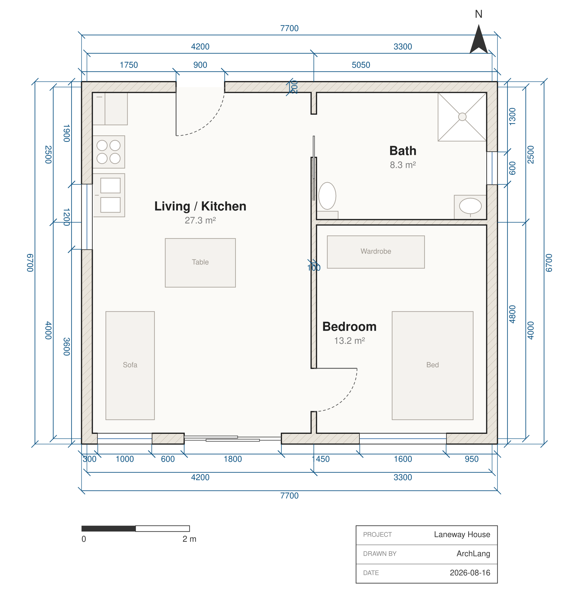
</a>

**↑ `arch compile laneway-house.arch` — that program, rendered.** The walls join and hatch
themselves, the hinged doors draw their own swing arcs, the sliding and pocket leaves draw panels
instead (a pocket door has no arc, because it has no swing), and `dims auto all` measures the
building it was given.

**▶ [Click the drawing](https://playground.archlang.uk/#z=jZZfbhs3EMbf9xQfpBcHsB1asRy7TQKkRYACMdKiTZFH7aw40jJekQJJeeUGBvLUAxQ9Qw_QI_QoOUkx5EpaObZbPVGrmR-_-bsa4jWc5aOKtXdugYYst3SDqYuR5owvn__E6QUW__yNWFOEZ9IBFMQJS-_mnhbHxbAY4p2LtbFz1OwZJmDpgonGWdaoblCT1cd4c83-Bm7JVizFyFgxiA4Ev7LQJkSyUwY1zs5BxRCWFqzRUtPgoHQWL-T4ChTxYunCq_LJIThhZ2YdV57hObjmmgNoTsaGKGgJzXlQ4hRDHJTG4oU8fgWy09p5fPn8V3mIcuOULpRnTw5BViPWjIpi_XSTqSUZLyE0ZDTcKqK6KYYoQ_RmWR6jDCYyPiFEzxxhnY81bssUTki02DrMaEq6-75syCKuvJXkfpMeaed8MRSrzkbKc5hO84ZC6P0yJ6_ZHheJMrjsyviDWwUe4FMBrKyJAYtFAcy90Rgr9D5DLMnHVLAA8owTpRBrM706RJDqlLNmFepym-WGrBahIMnSWBXoYlwtC0CbRQCtpK5NUwD3JqMokNNs9Mt2IqEB4HVkb5xHvt1yCBgphU84UIfqCQ6ej1U63O55M4X4uPfGLx_OxuorRk7h4wqy38OMlv9LRxZxv3ctJ-xK0fM-yd6noy6KdLiPIU36PxijXiCjDlMgT4rRL_2kMdcsU5YFB_MbQxzXcicaqrjB4NJcyyA_xVsTpzXbAVaBA5r8-Co_lPLLUEC71ibiJog5LaHQGh1rPHsm4grpxZ2GFEu6etS79TuK9UAM02Vic9eNNTrFqueWB7fT2I1xgRy3TJo468nMOxshnd31JEWMJHNZ54VSkD3HsEweIZKPCG3aZzY65MTtEbu-Co3RYpbI3TNhP9-yT86VSmaMhmdxD5Ji6mSlNqGI8dnW9XwrSzz3BVWsC5nwMnuWsrVaaq5Yp33y5fc_spo06WW-35t5HUsElilP24ksN7mE8jW4xuStnNAVN65NP3ykRfXthiJaSrRu1WiQWcDEJFspLBZ5q0pflB8mP_34_ds37yc___quPN4Pu-tmN73iuB_9xV7wPdlprxirXZsdupmUXJ_ucj1S6o7driZSko2desRufD7e8s6-sut2EkWcjLf3ilkBzFbemrRIZ97oOXdreO_t0yl3s1ngKK0MGLtrsB0iRHe9ITyGkJgfQHSzOgnGXj2GGKkHEZGqhnsSMWUb2bPOo3jyTKn1xW4c34v5YD8ONyP0Cd2ruXIxusVR6uz0GoKxScxYZfaFUuukbAP_xc1on93NT2Kn8z47Nc79cClepu8WyT7bu4rvY0e3zKLls8dWG_a5bNSe8A_kteDuJKZ2LfvuApmI3gVZ-faCbT4uUj_uGO0UuwT0GP3k9hmnSq2f32FUFIx9mNFPYmKcKbU-HaeGjyY28hdg6d1Hnsav_qJoT62dVDcYvPbT-pLsfABNkTEYqdHZkTo_Ojkb4La4Lf4F)** — it opens the
live playground with **this exact plan already loaded**. Change a number and watch it redraw;
the compiler runs in your browser, nothing is sent to a server.

</div>

> **Why a link and not a live embed?** ArchLang *does* ship an embeddable viewer — but
> **GitHub's markdown sanitizer strips `<iframe>`** (it comes back as escaped text, exactly like
> `<script>`), so no README on GitHub can host one. The embed works everywhere GitHub isn't:
> see [Embed a plan anywhere](#embed-a-plan-anywhere). Source:
> [`examples/laneway-house.arch`](examples/laneway-house.arch).

## 🌟 Introduction

**ArchLang** is a small declarative language for floor plans. You *declare* a plan — walls, rooms,
doors, windows, furniture — and the compiler renders a clean, professional **SVG** (also DXF, PDF,
PNG, and a zero-dependency ASCII plan).

Coordinates are integer **millimetres**, so output is **deterministic**: the same source always
produces byte-identical bytes, and changing one number changes exactly one thing. *"Make the bedroom
1 m wider"* is a one-number diff — not a re-roll of a raster image that silently redraws the kitchen
too.

The compiler is **pure TypeScript with zero runtime dependencies** and is isomorphic — the same code
runs in Node and in the browser, which is why the [playground](https://playground.archlang.uk)
is fully client-side.

> ArchLang is the floor-plan engine behind [ArchCanvas](https://github.com/chanmeng666/archcanvas),
> an AI design agent — but it stands alone and is useful in any app or script.

## 💡 Why it is different

Most "AI floor plan" tools generate a **picture**. A picture cannot be checked, diffed, or reasoned
about — and neither the model nor you can tell whether the bathroom is actually reachable.

ArchLang generates a **program**, and then lets you interrogate it as **facts**:

| | Raster image generation | **ArchLang** |
|---|---|---|
| Output | pixels | a `.arch` program → SVG / DXF / PDF / PNG / TXT |
| Edit "widen the bedroom" | re-roll the whole image | change one number |
| Same input twice | different image | **byte-identical** output |
| "Is the bath reachable?" | look at it and guess | `arch describe --json` → access graph |
| "Does it match the brief?" | eyeball it | `arch validate --intent` → exit code |
| Wrong syntax | — | **errors returned as data, each carrying its own `fix`** |

That last row is the whole design: **`compile()` never throws.** It *returns* `diagnostics` with byte
spans and a machine-applicable fix, which is what makes a tight self-correction loop possible.

## 🤖 The agent loop

An agent can author a plan, correct itself, and **confirm the plan matches the brief without
rendering an image at all** — which is what makes ArchLang cheap to drive from a text-only model.

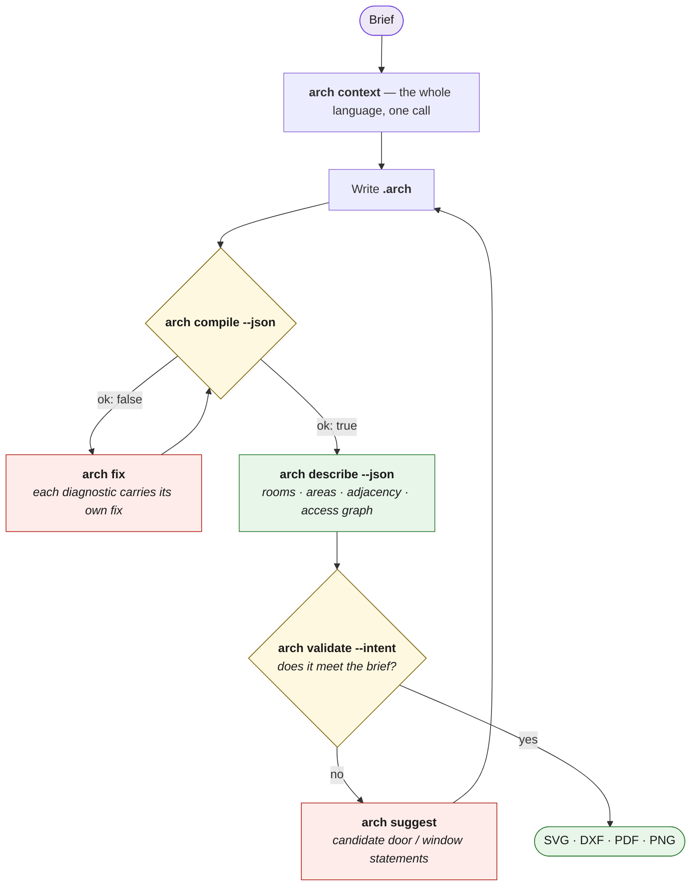
```mermaid
flowchart TD
    B([Brief]) --> S["<b>arch context</b> — the whole language, one call"]
    S --> W["Write <b>.arch</b>"]
    W --> C{"<b>arch compile --json</b>"}
    C -->|"ok: false"| F["<b>arch fix</b><br/><i>each diagnostic carries its own fix</i>"]
    F --> C
    C -->|"ok: true"| D["<b>arch describe --json</b><br/><i>rooms · areas · adjacency · access graph</i>"]
    D --> V{"<b>arch validate --intent</b><br/><i>does it meet the brief?</i>"}
    V -->|"no"| G["<b>arch suggest</b><br/><i>candidate door / window statements</i>"]
    G --> W
    V -->|"yes"| O([SVG · DXF · PDF · PNG])

    style B fill:#ede7f6,stroke:#6b3ae0,color:#1a1a1a
    style O fill:#e8f5e9,stroke:#2e7d32,color:#1a1a1a
    style C fill:#fff8e1,stroke:#7a6000,color:#1a1a1a
    style V fill:#fff8e1,stroke:#7a6000,color:#1a1a1a
    style D fill:#e8f5e9,stroke:#2e7d32,color:#1a1a1a
    style F fill:#fdecea,stroke:#b3261e,color:#1a1a1a
    style G fill:#fdecea,stroke:#b3261e,color:#1a1a1a
```

**Cold start in one command.** `arch context` prints the entire agent context — language spec,
workflow skill, CLI reference and every diagnostic code — as one system-prompt-ready document (the
same [`llms-full.txt`](https://archlang.uk/llms-full.txt) the docs site serves).

```bash
npx @chanmeng666/archlang context                       # EVERYTHING: spec + skill + CLI + error catalog
npx @chanmeng666/archlang context --section errors      # …or one section of it (the catalog alone: 60 KB → 13 KB)
npx @chanmeng666/archlang spec                          # just the language, one page (~2k tokens)
npx @chanmeng666/archlang help describe                 # one command, with worked examples
npx @chanmeng666/archlang compile plan.arch --json      # render → { ok, diagnostics, summary }
npx @chanmeng666/archlang fix plan.arch --dry-run       # the exact unified diff it would write, applying nothing
npx @chanmeng666/archlang describe plan.arch --json     # VERIFY, without an image
npx @chanmeng666/archlang validate plan.arch --strict   # the ship gate
```

Every command takes `--json` (result on stdout, messages on stderr) with deterministic exit codes
(`0` ok · `2` user-source error · `1` IO · `3` usage) — and a typo *earns* that `3`: `arch lint
--jsn` exits 3 with `did you mean --json?` rather than quietly reading `--jsn` as a filename, and
`arch comple` suggests `compile`.

**One manifest, no drift.** The per-command help (`arch <cmd> --help`), the flag parser, and the
generated **[CLI reference](https://archlang.uk/cli)** are all rendered from the same
manifest — which is why they cannot advertise a flag a command doesn't take. `arch manifest --json`
is that manifest as data, and `arch <cmd> --help` is the cheap way to read one row of it.

Reads are bounded, so a big plan can't flood a context window: `describe --select`/`--room`,
`lint|validate --code`/`--severity`, `context --section`. Filtering what you *read* never changes
what *gates* — the exit code always weighs every diagnostic. And because `arch fix` rewrites your
source, it prints the unified diff first and takes `--backup`.

See [`SKILL.md`](SKILL.md).

<details>
<summary><b>Machine-native artifacts</b> — Plan JSON, a GBNF grammar, an intent schema, and an optional MCP server</summary>

<br/>

| Artifact | Use |
|---|---|
| [`/plan.schema.json`](https://archlang.uk/plan.schema.json) | Emit structured JSON, compile it with `arch compile --from-json` |
| [`/archlang.gbnf`](https://archlang.uk/archlang.gbnf) | Constrain a local model to parseable output |
| [`/intent.schema.json`](https://archlang.uk/intent.schema.json) | Write the brief down as a contract; gate on it with `validate --intent` |
| [`/llms-full.txt`](https://archlang.uk/llms-full.txt) | The whole context bundle (`arch context`) |

**MCP server (optional).** [`@chanmeng666/archlang-mcp`](packages/mcp) is a stdio Model Context
Protocol shim over the library, listed on the official registry as `io.github.ChanMeng666/archlang-mcp`:

```bash
claude mcp add archlang -- npx -y @chanmeng666/archlang-mcp
```

Prefer the **CLI** when your agent has a shell — a CLI costs nothing in the context window until it
is called, whereas an MCP tool schema sits there permanently. The server exists so MCP-native hosts
can *discover* ArchLang. The core stays zero-dependency; the SDK lives only in that package
([ADR 0012](docs/adr/0012-mcp-shim-discoverability.md)).

**In CI:** [`.github/actions/arch-render`](.github/actions/arch-render) renders every ` ```arch `
fence in your Markdown to images in one step.

</details>

## ✨ Features

<details open>
<summary><b>It draws like an architect, not like a plotter</b></summary>

<br/>

Poché-hatched walls (by material), door **swing arcs**, window glazing, computed room areas,
dimension lines, layers, line weights, a north arrow, a scale bar and a title block. Real **fixture
symbols** for WC, basin, shower, bathtub, sink, counter, fridge and stove — plus `dims auto` to
synthesize dimension strings for you.

</details>

<details>
<summary><b>It checks architectural soundness, not just syntax</b></summary>

<br/>

`arch lint` encodes tacit professional knowledge: a bathroom reachable only *through* a bedroom, a
wet room that isn't fully walled in, a door whose swing hits furniture or another door, a windowless
bedroom, an unenterable room, a too-narrow door, a bath/kitchen with no fixtures, and a room whose use
was merely *inferred* from an indirect label (`W_ALIAS_MATCH` — with a fix that pins the explicit
`uses`). All tunable via the ruleset.

</details>

<details>
<summary><b>It models how a person actually walks the plan</b></summary>

<br/>

`arch describe` runs a clearance-eroded nav grid: per-room walk distance, the **narrowest pinch on
the way in**, and how circuitous the route is — with advisory lint for a too-tight
(`W_PATH_TOO_NARROW`) or roundabout (`W_CIRCUITOUS_PATH`) walk, and an opt-in
`arch compile --overlay circulation` that draws the routes on top of the plan.

**Facts and advice — never an invisible auto-arranger** ([ADR 0005](docs/adr/0005-no-invisible-architect.md)).
`arch repair` is the one *explicit* corrector: it pushes furniture out of walls, doorways and swing
arcs, and emits a change log you review.

</details>

<details>
<summary><b>Errors are data, and many carry a machine-applicable fix</b></summary>

<br/>

`compile()` **never throws** on bad source — it *returns* `diagnostics` with byte spans, a catalogued
`E_*`/`W_*` code, and a `fix`. Where the edit is mechanical, the diagnostic also carries applicable
`fixes` that `arch fix` applies for you. `--error-svg` even turns a plan that *won't* compile into a
self-describing error card an agent can look at.

</details>

<details>
<summary><b>Parametric, scriptable, and still deterministic</b></summary>

<br/>

Values, arithmetic, arrays, `for`/`if`/`while` and pure functions — plus **relational placement**
(`right-of` / `below` / …) and room **strips**, resolved by deterministic topological arithmetic, not
an optimizer. All of it expands at compile time: no runtime, no clock, no I/O. Optional metric unit
suffixes (`4m` / `40cm` / `20mm`) fold exactly to millimetres at lex time.

</details>

<details>
<summary><b>Five output formats · accessible SVG · IDE-grade tooling</b></summary>

<br/>

**SVG**, **DXF** and a **TXT** ASCII plan with zero dependencies; **PDF** (vector, selectable text)
and **PNG** (deterministic raster) via optional, lazily-loaded add-ons the default install never
pulls. `arch compile --accessible` stamps the SVG with `<title>`/`<desc>` + `role="img"`.

A full **LSP** (hover, completion, go-to-definition, rename, signature help), an `arch fmt`
formatter, an `arch explain <CODE>` catalog, a self-documenting CLI (`arch <cmd> --help`, rendered
from the manifest, worked examples included), and a
[VS Code extension](https://marketplace.visualstudio.com/items?itemName=ChanMeng.archlang).

</details>

## 🚀 Quick start

```bash
npx @chanmeng666/archlang new -o plan.arch          # scaffold a starter plan
npx @chanmeng666/archlang compile plan.arch -o plan.svg
```

Or install it:

```bash
npm install @chanmeng666/archlang
```

**As a library** (zero dependencies, runs in Node *and* the browser):

```ts
import { compile } from "@chanmeng666/archlang";

const { svg, diagnostics } = compile(`
plan "Tiny" {
  units mm
  grid 50
  wall exterior thickness 200 { (0,0) (4000,0) (4000,3000) (0,3000) close }
  room id=r at (0,0) size 4000x3000 label "Studio"
  door at (2000,3000) width 900 wall exterior hinge left swing in
  window at (0,1500) width 1200 wall exterior
}`);

// compile() never throws — errors come back as data, each with a span and a fix.
if (diagnostics.some((d) => d.severity === "error")) console.error(diagnostics);
else writeFileSync("tiny.svg", svg);
```

**Also exported, all pure:** `describe()` (facts), `lint()` (soundness), `validateIntent()` +
`projectSubscores()` (does it match the brief?), `repair()`, `applyFixes()`, `suggestTopology()`,
`renderAscii()`, `toDxf()`, and the LSP core (`completion`, `hover`, …).

<details>
<summary><b>Develop this repo</b></summary>

<br/>

```bash
npm install          # one install bootstraps every workspace
npm run build        # build the library + CLI into dist/
npm run check        # typecheck + lint + the full test suite
npm run check:drift  # every generated artifact must match its source
npm run playground:dev   # build the core, then open the playground
```

</details>

## 🖼️ Gallery

Every one of these is a real, compiled example from [`examples/`](examples) — and every drawing on
this page is **generated from its source by `npm run gen:example-svgs`**, so a picture here can
never drift from the compiler that made it. Click a drawing to open it in the playground, or the
name for the source.

<table>
<tr>
<td width="33%" align="center" valign="top">
<a href="https://playground.archlang.uk/#z=jVfbjts4En33Vxy4H9pG3B3Z7UvSQRbIJD2YwQZYIJnZeUxoqWRxmyYFkmq7dxBgn_YL5l_2fT5lvmRQRcmW3VlM-qVpieewLqeKpQu8Qe62tcojQmwK7aBq5eOWbMQf__kNsSLkyjqrc2XwxufVe2U3oL3a1oauBxeDC3mqI-Wx8cqYRwTX2AKjWoVAAZ-VzysYbePn8S3ogfwjvHNbuJpsgCtLKORko1cGlTJmMrhAcHLyWsUKOsAyDJ5UXlGBWHnXbKq0gwome3WyvWzYDLK5cYEKKFsMLlDqGKnATseKmQxKvY-Np_CKN8A6FM55GFIlwo6oDnA2OpSNt5o3XuMjmfIqdzYqbYk5R9ZBb2vnYxizzTpKNLWhgNK7LRSCthtDKDVHqzbKYvgxBXr63Ychfh0AjdUxYLsdABuvCyyyARByZQjTW_lhnY8VmnowAC5wt4_ktfMIFRmDZ-CM6aidDdf4qSLsX8-zLEOhH3TBcWtskPh8__P796hIb6rYj7CQ6oCdMoYKyYgYz--NftB2g1CrnFKQvcBzZ5qtRagN2645UG0q8FyyiOfCfT2A8II6oxErnd9bCgGzLMOvGGWTbIzRKst6i2WW8bpbSCbxpSM7ONwjmyayeUczP9J8M-4mnbo6rr8ZOp8foWn9hbMlEdHFa_-pjaSKrcPpL-h_E5hgz6bCqDUZDN-nvc_xdx3ziuwQDZdSS3GfHp6wr6lgOmbvItCxsyP7mx77dylRQxz_hL5N4AmvpLLHm6Jy5J3Oj7w_KGP6pC0tU5zaymXa40zh6nEue7aqWH2FU2SbioEbh80pafDrkhUnjLb3gSu03dbJlYu_q4RroWyj_8d_f0tIHbhDKW4l3LP43SjXPm-MEkFYoiKcNJDxq_4RQsrHiOPcxLChCJXakIC45jpL2Qh5CHC8ik9bpW0br5ujqHe6iBVLMDsvsErbDcFQGYGwY3M1i6WzXRevXV-NKa-rI-fLLDsX_blJPbkt5wdZJPiLp_DWpNQ6kkmuiU9Ie7pYHnTxV6R9P5mUC1bbwu3aUpuJaUAXsMV5wE4BUsC86RDh2TcAFrMjYHUw9QAQBbS1zO0Yyji7kYyn1s7bb_muuMfv_0PuGhvJ8zJE90C8KL0uNoRR4dXOQgWEx-3amTBmuRzuqK43fBKqVjGT2YIjIAX2InWaE0x3HLqUsssJJJjlVzDJLvQwLxd_hWldOGJmq6fnLLJBvwifHer0wDPBPdURuSHFhSNRFB2JBsJpPIIrVYrDIpvMbw6NhlWxF6G3jeajK9XwBCoaFzHeJIW3UBbHfnbaT4fJaO5Wydh2tvh_tl4G8MTziJo1PzpzgXUs_UxIu74wvkWo3I48tJWHpfLInbfkJ1iroC3URmkborw91MkEv7yFS5Dgmva-F4F2E57UUKy0LzojxYsQ1WOQvsHjwqNreBSEymOT5rxINbQNuqDUOHn2-OWt9EubV87zrOYOdJchHQ8qNjRJ41KAdzF10dH0RSYG5TpE8raFCnHCscljZn939-HHf969e4XPpWlC9RlbUoHD3c0tKsrmS55MLHmUKid4FSvy_NYeiMVNT3lUPKVdBhlEyRtt6WgmOzDLsu02DVyXcqWVV8c54DChWrWl4kyAKWXSKaVTHC_Ql50E-XroZe4Oz_BRHAgYpQSPT5UpyRZObjyT-fykhuaLxLlW-X2XgOq8nR_ZdrkUpLZor-aUPKxdjCxlDvFhTtmvsrZA3-kt2cCZC9Gzam9TNKUJBqi1e6AJ3AP5rhXaGKA8fxykMdVTSZ5snlIx2unI0Ryjdpq3Bh072a4bbQptN5cB__j5p7sPktCA0f711TTLnq-mWTbBY_qx5KmslC59cZ66cZdOMUeM51QHVrqPHFB-KaUhkuFL25MquCB3yhcTIU25rt09NygJ8mH26AwVIe8qbSiVXa0sH6KN6bTaV1pb6L0ncilz279p_6_a_3L3y4Sgt-3VzV6Pr_42alecS1eWgSJmiwyR9hFD3jjsUKs-6kjxFHXTR2WTZQtJA_rZWXytJtTq5KxpN7AwcHqYTJ-gloIaAFFHQ_JdBNTe_YvyePhketN9mw7ltdyFn9aPGPIn6FtlH1Ro36hIGM6y2fIqW17NVvz0y-DL4E8">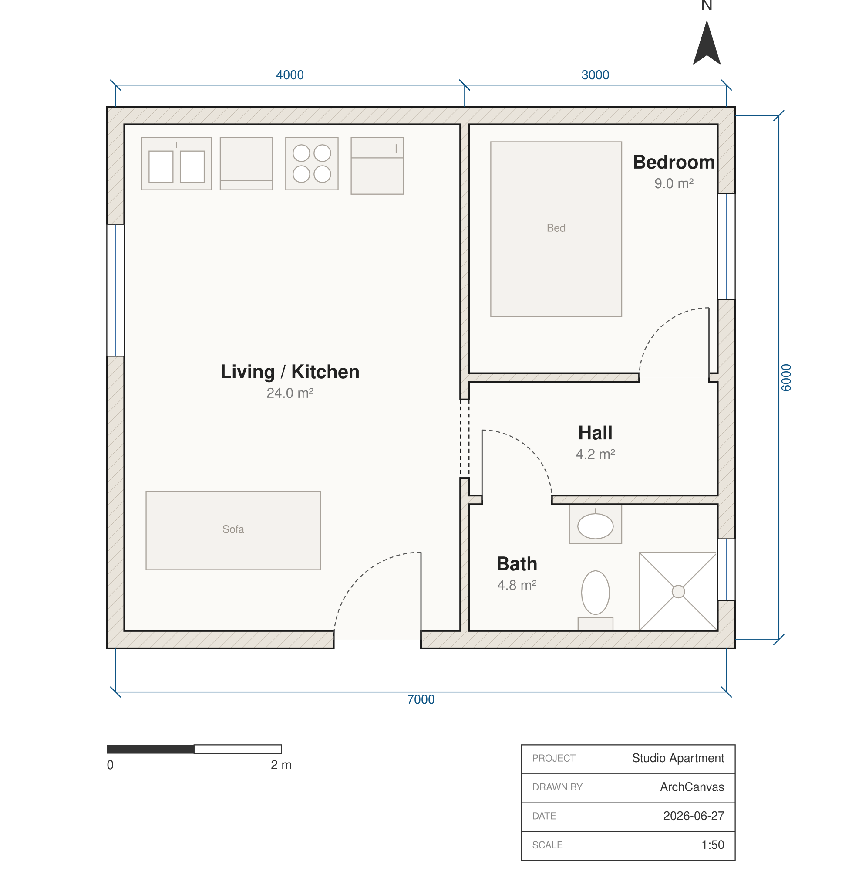</a><br/>
<b><a href="examples/studio.arch">studio</a></b><br/>
<sub>The flagship: fitted kitchen and bath,<br/>an enclosed bath off a central hall.<br/><b>Lint-clean, and import-free.</b></sub>
</td>
<td width="33%" align="center" valign="top">
<a href="https://playground.archlang.uk/#z=lZXdbts2FMfv9RR_uDcJYHeUHCdegQ3ohg0DtmE3va9p8djkSpMCeRQ5KwL0IQbsgfYme5KClJRYcdZluqFInv-P54Mfr_AW3PnFllTw_gDZyMAHcozOsIZETY6DtKh9CEb58LporHSYvev84rtB9KOVPMPHAmid4YjDoQD2wSiUQhRArKUllG_6nvOBNYLZay4KoJPWgo5MwfgA1qb-4ChGVCuBj7gQc3GJi1IIcfq3FiJ1xp_a-ki4H2kpBsPGuxNcKTLuauTkn1VWv1jXmw8uvFx7c6K9efT-PkWf82fUN-H9B8O1JgfJQ9DDF80fhLT8MSFg5ZYsZj8P1l_hF3Nr3H42YW1JlUmbWGPED6zrp6xfZWQKGKp5RqpG0hjE1KvlCWncENUTiGQ9cWfgZMjyDCJZnzuiU5IHxs1_Mn6S1s5SfpX34XHdapU1nVGs8bUQZ7XTxu0JlnaM2Bm3h3GnkNXqceEesv7_kOz99cs8yafkkZI2m3HKdxlUnVS2B6WR6YGaKtbniqsvK8R8-VDzXlGuvqzoT0ev-ldFAeza4Ay3gbAl1Wd3EF72RS3XQhyrcrK7Zs8Kl6kqJ8KrJBRPhAXwCr_dUhgdcRzn8C1Howg7WRPYT_pvsElN3KBpo6YIkrUGOdV44ziZZqZ37MGa-hANI7Quwjj2c8R-pgnGMSnERjqYmMc4tIRSLIXA339hnVrWlInb1liVSn4gGdtAEf98-jOLcnKzfWrz6cj3bGPbCC3tLltFTdamzIwOzzNWOgXnmU5sTExnJ43m-1ZTzmot20jYjDf4BtHJZvB6vNxeZ-QPR1mzvctTMhjWB2JTQ0JLpxZdMMzksGE68gZ74ogueLfHhWG0kVRKeZR3fVyXianMISc_Ptzui28nl77f7SIxbvJbMrHOps-YFQAbtpRfKKAJ_neq-ZknLE-rIDv3fnuH2dtQ6--lu5VxmJFMmFWiul6I60W1SqP3xX3xGQ">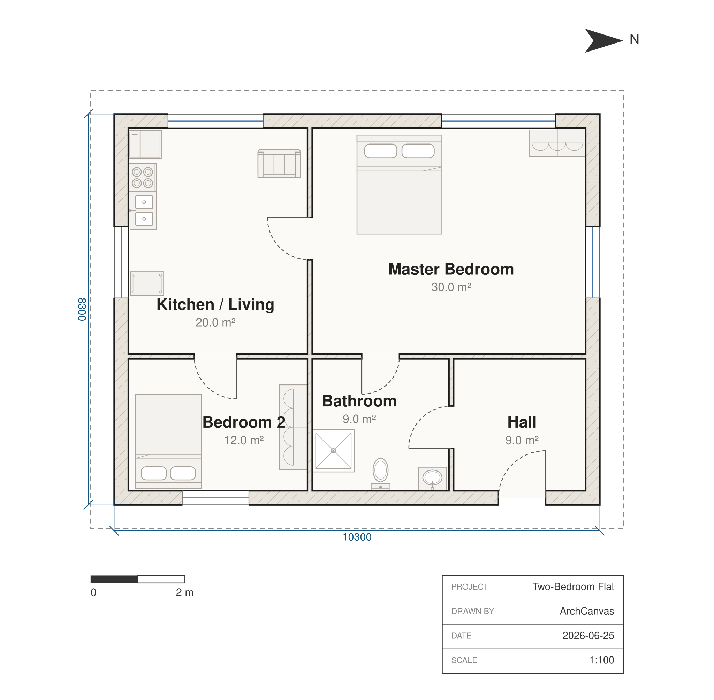</a><br/>
<b><a href="examples/two-bed.arch">two-bed</a></b><br/>
<sub>A larger dwelling: central corridor,<br/>five rooms, windows on three exterior walls.</sub>
</td>
<td width="33%" align="center" valign="top">
<a href="https://playground.archlang.uk/#z=hVXbaiNHEH2frzjIhJWIJUZeLSHBNnhDAoE8JXm3StMlTZOZrqG7xuNcDH7aDwj5gjzsh_lLQnePbibBTx7aVadOnao6usAdxPF8w8aLtNg2pKBea_FsMFitoTXjYblYvkfXUMUtO0Xod-Tx8vw3nKAmZ-aVtF2vbIoLVCLeWEfKAVvxkI6ddbsA8dj23lntPS_wg4If2Vc2cLiEyo61Zv9NcQHg5fkfrIN6261TFYKXAbJFJBnQkDWQXsHOQCX-OaQdqpEqVTWnAMJATYPNb-gkWLXiMF0bEf_nYJ2RAS_PnyEO1zHsFqS47iTcrmcHWEIMh9akqUSAykDegOCoZZOYYboOg3U7WKeynqG2bscmwo0ETokepMi6GnhuSO0DZ8IjnnW4jp-3IFfVEkX_nGh9K21nGw6oGiYHcgYdhcABa_JVjcY6XS-KriGHyd1ei-XHnyb4owB6ZzWgbQtg563BsiwLwInXGn1XFMAFfrQPsZkvsd-OpHvDW52rzL3d1RolJaRJXSLU5GMCYYUWhjutFwXyf5HDSTEtL8sZdtShRM3pdVWWZWKF3LY1N_6-ydWD_Z1zQEMbbjDJrCZAH5vNUa9SN2ziQ0p9f5L6MfcxyaljVwXwlPv97lHZW_EINTcNKK5v7yN_SjTjCAOmTFUNGnUPSl5fPv01bmJeOohTmSXMrulDOqGOvObN27AOzC696iB5p6NQaUWsuRnu8xx4zwda2-pXxyHgKio1ajj9qizTx9NZcpD-reSo5z4_f59DDBwUb9f_72SmN5L3tP-_fhQLJ5IdIZYZYrWHWJ1C5Ck69eQqjtVKtC2oEbdLamdlYpnLk9tMNx0f34U8zmQr5EyCG_0knXQCGfcyTm2BX2o-XEcyCHGvpp3NwrpoFnHIKcqaG3PfknUxfj8x0kx5sEbr2GiZScIx-ZHZ0V6wv5AzzLT5CTNLeI75dVniHGLDJqt2h9EJK3YavV8c0qLH1t6F4zijUGlZc3iqldaFFB_KL_bsV8lPToPSWpwHXZVlrv79ay-MtpL9zrpgDR-5YOr4gT1ku41HePitmUVSR08NsiVYd1BpD6fSzaODRVzW6A7ZJqJKj0mf0St-li1NziCTtgly9JcRMjsb8Bpy-aEsH6_O7WdSPBX_Ag">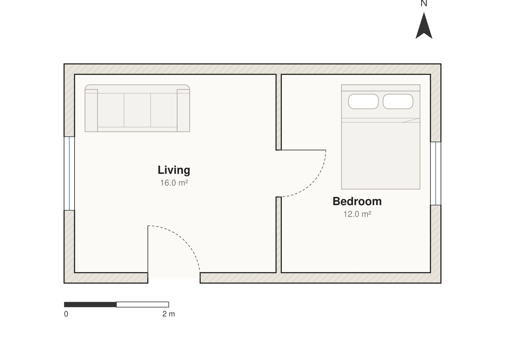</a><br/>
<b><a href="examples/attached.arch">attached</a></b><br/>
<sub>No hand-computed coordinates at all:<br/>strips, on-wall openings, anchors.</sub>
</td>
</tr>
<tr>
<td width="33%" align="center" valign="top">
<a href="https://playground.archlang.uk/#z=pVrNchs3Er7zKbqkQ6RaUktSliIr5QMty7YqCpmVqPKRBGeaHEQgwAAYjZiUq_IQeYZ9sDzJVjeAmSEdx85GBxfnpz800H9f9_gQRuCkXinsOW8sbsGVi9IuhIZFqVdCmQr--O138AXC5O7mejwdTW8m495o_KY3-fF6fDN-dw_4LNYbhXD0NDgZnh2fdA47hzAtEDbKeFhao71jBOctogej-ep-8jB9D0LnfLUSNkedno0nd9P3XZDhypnSF2h15xAKXEu3KdDiCUwLQWAIS5F5yDGTOYaFqsIoBCW2pvRdcIZvbpTQ4Lzw6ED6S9YSwEmP8GtSjVdqLRJvfOSX5_TuHHIrKgfa-ELq1QnceNBijQ6W8gkhlxYzL412tJW5sFkBObrMygVCr_eTMxp6PYcKM89rzy8ZmZefw9H9cRfmC5E9zuFoXB99OBx6hD-Xwhs7czJHeqULC8xE6ZKmZskC8bXOYfsKlERS3PqiEjYnOFdqKx0muOtjtgfddujT3Q_HJ_CeDiMqJnROOu-qIiwGq45-uAa61YWqkFkB0pGDZF5toSq2_E5hSGFfWu1AVGJLPrKmJ51DsEbkl_yWkk9Sr8Aas2atFsYXsMCcbjjw4jEsyPshFxC0ZnInh_ZJZggLuvHHb793DgG1t9suFEKpLiyEL7qgRKlzuvkofVag5gOXjrwke8QchDJ61XLdE5hoBJE_SWfsFpTUnlQuFYJFkZNfdWH-YXY3mfwwG0-ms-v_PIymk7vZ29HVzfjd_DtQKJ4QRNoHVNIXyZdgUXqQ3gEKR7iV1LmpeEvSQyWVAie24EwdYQ753N_cjd5Ob8bv4P31w93N_fTm6h7eTu5gNIbR_Y_XV9MuLQECcrFVclV4WKNwpcU1an8CI5sVt0KvoBCucwjagCs1rE2OigRBCS99mSNrog3kwiNH1Z4LOLF10ehkVJE2oIx5JOAgHrZaFcLjE1oQC1N6KEwF6zIrIKiXmTVHsjXlqgDpm5RiKBGQDZfJ1TmsZYj73BgL39-M39yfwIjOeklPeO-qIu1obcxrN-H4sEhOpHs5LkWpPDxKnTvg6KfDRUH7CZewKKXK0UJlSpWDyHwplNrCpuREVOcUJXPaZDuxsWopnpelUr0Cea_0Mlow2oc0lWP2yCgbkz2ih4AS_NUslyBgcNbvw3oNmbFW5sZespF4syFfBhfXlBrjHRJn0IVcGpVH0Nr96R4pLEkJ8kBTaTAb1ByAgs_cF0KDeeJfCGuRFVKj4x2P-PzC2QZFXIW4qZNkcBY6gftK6tXR8RwshvDXpVKwNBaEUtEWMb18mN1_uBm_m01e30_vHq6m12_mkAnNxtxs1BbCea35UI1WIbX4ytSxRQu6lIZSvugcQjL0PGg8h8UWKis9bVYbtj8IchnVhUxYS67sSHEQNjvpsMMdvI7l8QB-7QCUmk5tve4AHMJ8ZWUOZ_15CLtBv38J5Otb2AjrJVWH4F7S0UPwhcwe-YwELOWzLy17dYY5zJeqdMWcYcVKSO1CxVOCfNRoEBwLPYbQ6Bwc_fHbf8_6x5AZY3OphUdKWuQ1_T6wYpzOtNgEJ2Zoa8qQZCjBw814OglllIxCoWKFdEgmeftwN76ZPtxdzz6Mbm9nV5Pb25v7m8l4HnTho_FUlqULOqcIIV-lkldXNNKkEI6suEAQC4X0E583lnbBQSIydLA1ZTiMtP-TDkA84A6Ay4RCGFwO-nQVakG56QDkcu1AlN6QHTudry70rHav1-uBK1Ap-BdJlBkbpfd__AWPqGZuIzXOwZba1SkAKpn7gk84l081e4kZg0sXV0Z2nlgisJBsqu9q4FDp5pCbKO_EGjmmWpyLwE7gNZVQSmrEWPKaOqTU6WCBylTBci0nNHoeQm2xhbuHMby5uZ-OxlfXdd1mT_mGKJB1HjZGah9ybFwh6Pph9uPk6vvr6ezuYTxPJSiovBEaCSATT9JvY90lRw-KOlxxqepA8EmZvwrWoT989milsQBNFAz7ffgVjvrd_jEcDYb9fvvXxVmfLtKPTBmH8LGFXc0WmA8IuwnYBnsQsM8TKP94cUFQn4AMvwDyMoG8_BwI-81fgyTBuL0_Q0n85i9QThvZ8Duczp42kVZ9Cef8tKVQuNg7G-GLL5zN2UUDxL__TKFYwv4K56Kl0EV7Y02oB0rZ-4d_jPeuFbxHnI-OA50Na2zQUKvkpOf4cApxA1J3Y4Eglw-8Zh1bIQaNPKu3FBklgUB2T-C-iW044gS2sxYn4txwEdKIORMpCIRa5q_sLDJsKnYhVMKfk78gkFc_kzuAEgtUcHAbXv43vJFECw6gdOgSSc_53g54CiECT7GSwE_3wV_Hkj04iDoweCzk-7DDBPvya2GHX4RNARKOIoTBDuzptw3s9-HlBBphI8QOLDGxpG0rwBiWtH9mLhdh3wulGswEyxCZtFlJPNzs4qcwqvGDnzP-8KLffx4OW6chfPEpPlPDHa-IIUWYrRgMmMM9zNvw8t5RlF4q6bc7sNx-RVUv9lR90d-DvaaXD_ZVZYhW2HLNuuSgYdK2QUuRVfI5wd8KW-oteFIRiLp0aRIR62e7v5Q-9RtMO-v60yLAFGcBKH-VzwIwbXzQbxJQKP50J-SzUNEYBBQufeScUndqDVu9BDU4sXWQjtsp6u8we6x5e829pGvrHZtwxmy32JkIlJ8SqIOlsJFgR1JFjSp1aiIQfBRMl5nJKFInlHjWiLVvUR0u7oFaekOThzZlcF5YHzl8XNAZJXPYSLQMukBfYdKr3lzs80OLGfvbzJrIHVdKOLdrhHh2qTcja1AwdmtLDPcs0ewlGOB1Gj08Us4OrRo3EpdNJ5FMQax1Ran5850FtTkE67mNp74ljVDYqwIfi-0b82oeFbQ6EbKPWQR2urtVTr1GQ2IPwsO3lGfiRilBttys8bM9jOEexqBPIPsYNnSxn_gq5RVy0nZbyEybWL82oaNeGZPTPlbmEkzp2TmoDVEme3RNq8ugqd2lsWB6cWlK5WKH66Sm9WLbzDsR2lVItNZQ9xxGW4pnFWEsEHHdGr3MgnbkiW1WTRYVioZBFTrPPYpwYagYvZ0PgMaC8qnNZhlbJp_m5LZeU3EP7s2OtuPaP4n1ovbrlIRDqLfjinHj_EGu6RCEZ5HMWE3ZQDuPIu_GmQXTgZInJHFskPpIenJxFm5pRr0IL4R4JcYQE8cecw-LW9wYS_MqOA0grjB23xGpPEWDBF-K_FF4Kn8tX2odZeNC9XyCMjwnqWVpeRjRGsxRs0OHSbaP0w36x-0MMxgy5g62nYwu60CjZMjaVMnPKPF9OvDY3WAyU1x4f4-nO5sMG7sSDvOki7tsl_Zw5mmaQyuldCfzV2aHo1BgJJoS09eLlL5iyO6Lt9nei0_EB18S34hQwGuqcXZ21oi_5PQSxBsitAPQJgChDgYGENcfttYPJ9iq9CHN_1OKznjjMC-mTjWNZQqxkJ5HEOxkK4zfK_Zot3AbzHxrrs2pnqqBSw3u5wa_8HMpaXw8LTBkdNQUXD5dpqmEzJGb3DA4lfkrncwW-W7N0vetxjVrTzRScBKl_J9ko-j5F0SHta0a2S-L4o4o93_kmZ-aOTXwhxA_QvDuQTio6IGIXyr2wCOhbsCDF-47YQMeBsp7of0Nccl8B7qaOakfITVD5-f93dP6c71dNFq3SRQEs4PsEkvnyDmv-V9EPt9VuuX0cRb4D70-On09WeSqEL5YCQ1i4YwqPbbmhXWBEKxWN87tNTKVIbHg7dbQt7Q5O3X9AYVKja0nWbyjb1wonXGIE0qnWS4dffCSVOVz6bzQWeCko9vJ-F3oXaMEHMVZURyHUU7fmTSlUc5x852Iy7BxMnZMh3Vh_bkU1qPt0fiZGVeOVLjz3VnWd9GUv2D8FlE_zYQXyqxKPKnLlBNaemG3jcEIV-isMKRz8D1pYy-0W57jgLeehjFovRhxZv5aEriy1FTg346urvkQtdkf_lJOstJ77hEqTfSzoMFfB6hyaskOEE0V_D3Zus1746mfQjASDCiupIamS4ZDKHUeHT54-s4SzpsnTK3bVy0x2FtiB25pZb7CvwHHZHcHbgePuWJ8gWMz2CrSYWCTxMb0rP98zqPlRrrKWI9PpBfGe6IoLel-__nbPWlXmIrZxp50oNFt6Zf9_vPLwBoa8cyU2if5ulP_nAJUHlj_XRXMUtRzme4wZLqmvecsGvvwe7MUBzvCoU7WqWzQzDN4sbbwlF7dlV5gnkZCQ1q7WZoIzTO3YM3s5nOyL79KtgPgpVfIH2gANtb8RF8gDu7T_3CoP-Hwc_qsr2eLLRzQ99AroZ-Ei08oKR4M-8PzXv-iNzilux87Hzv_Aw">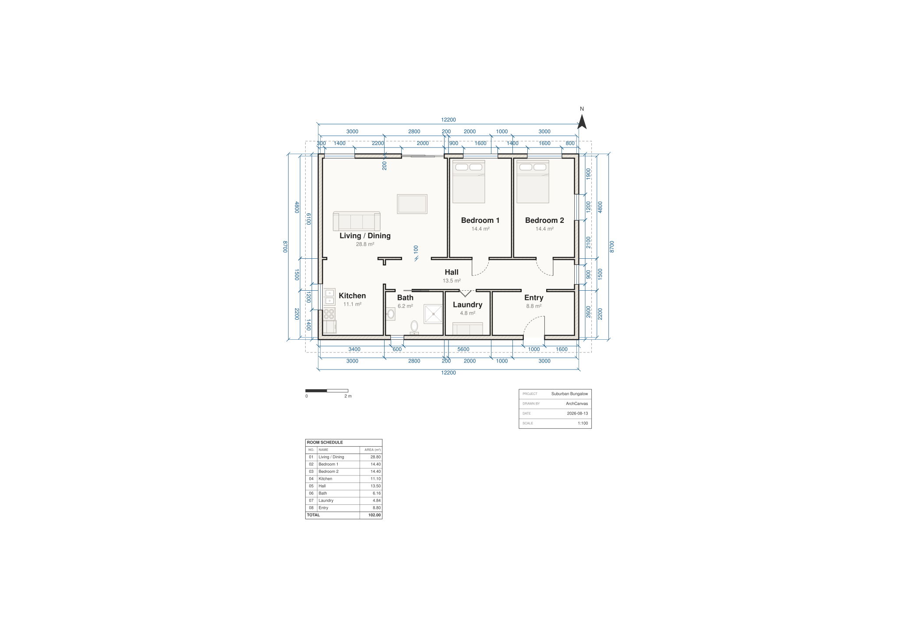</a><br/>
<b><a href="examples/bungalow.arch">bungalow</a></b><br/>
<sub>The door vocabulary: sliding, pocket<br/>and bifold leaves — panels, not arcs.</sub>
</td>
<td width="33%" align="center" valign="top">
<a href="https://playground.archlang.uk/#z=pVrdchvHcr7HU3SR5ZKUADBAEiLFRK6CTUhiSiFVJE9k34Qc7Dawczg7s2dmlgv4lKv8EHmG82B-klT3zOwuSEpKfHAjYtHo_5-vG9qHORS4EWujhYK1sDlqqMSDVNLoU3ByA96KCn81MmcCpdBKdGClXku9BgGZtFmthAVrfK1zMR7sD_Zh8YB2C8YXaAE3oqwUgtTpT_c9SAfLWioPK2tKsJh5odcK3RCWmInaIfhCeCJr6F8x2IeVMsZCpYSG2tVCqS1IN4abQjowGolWG594sU7zi18-f1hcLYYgdA7SA26k8w68AVeYZrAfpPgCwTcGtNEj-rpUUiObZEpYGVs6yExZGYfQSF-Q1bV9wBwaodQpGwyB-I_f_wGVUdu10fByM9y-4ie9lyAnVEpm0rMT4Y_f_4fcknnSCJXIEIRFMQQllqhAeGb-7RfZkKH21sh8CNrA0tQ6JwlLswGht02BloNAlEK7Bu2u3hRJhSA8vMw2w2z7CqzIZe1Ia7DELYRgyApCicLVFnMQLhigtlDJq_8-YK7CZtEBkcnVY4VbJ36ef_wIi7P3iyHkVjSaGArwtka4_q_335_9_I64sZdvPizgw-Ln-fvLCzi_hovLG7havP_Lx_nVEOYXZ3DzYX5DHxDdp8vzi5sxzMFiSIaY6GBWIWnLpNlgHzJhOa9XprZEIL2DB7ReZujII1t4C__6_Qiu_sX9zfqXh6--P-DICQ3SWuElF5CuyyVacv7ayhwyoQf7FG6LzjG5M8zZKVNhDiuRiRwdaHxAm_zZ-lrorS-kXp-CQ88JbmpPulzBWzieTSaDfTAaBMwmUJZBImU5iqwAbUpJGhEdYL5GSmB0sBTZPT08IseQtylBuAYyoZTjPwf74WvSgdpKvQ7FQwr0CKVnNqCMuXeg5D0pXkrnxT2O4dqAp7J0BSrV1npS-HB0NJqBt5JLHqR2HkU-jk1jxzngPFYOjkgfkVnjHCvzejKZQG4aPYSmkFkx2CchKQtJ-6A0MkcKJG5ACZ1Tp-ACIHelygV4OSWOw-PJZPIKXk6nxGAa3sx6f097ROH54c43-B0zfUd5lOJrVlEl6jFmxdoPgb4ygQ1MD-hf84BWKBWTKmkeEyrq7ApEH0wV0BRGIZRSKVmi57whJ-doKe9CztQ-9SsvKgydeQ4OM6PzthyEbx1XCLUClwmF4ChPpXYyR5CeuizyOOhGgLCUEEg9NI0IBz8ubj4vFhepo56GgqqM1N5xZkYn1B5tr8B03vZgqTVbjG6wD0ssZPisZM9wXhob4h-9Erw8DMpzhsYPgvZDOORkQazGcC033I-EGuyDq8w9jbJag1CG6wDhr0ZqF5JHQCmc0XYLua1LWMlQIOT0PFfRneQX_liGzyphPTTG-gIsCu6_vpEZjuE8TDMrvUfucZcXCx4glBJkucNSpmk62Ic7YbM7rl0HL31o3jThIFPG4UjoEfVYmk6n1EvpYR5aatKFmBZCPSCXq3SvhmCoI4kwKJCmHAmPfZD9RIZTRlL9Zvfj8DBOVgEriwhZYWSGp4Fn9LTmYRJT6oWD84ur-dn5X66H1PJ89NEL1xccvxunjtQus3KJeZhQwidmQ0owU2cFww2lOAvJY1TEKRlfxLRhb1Gy9qCDQh8kRYACS8rZOx57UThNv54T7jjXuOJEiT2dY7dJqhubSy3sFuY2Kz4KvaZBYvQDapoHwQrB8_WFC-OYiKXjGUCR33HIsC0Di5R3oZEHE7fMuaYiEg7mZ_8x_2lxcUMwpm-YFYy3fCE02UFTwRXG-jDQQg2HylsRzOB-SOng4fA1daRKON_FsxfNzFiNlgfh4eHsaCeo4MgS07hHEaE-1cYk9XjSRKF4iNDRoiP76WmtiQ1GiJEKX3r2CsUrlyXkUpRI-keL7-Iw4sEYx2ZVSG4PXcvKBFWGqVBLvQ59qzJOUoyQWRsdLBEe_r3K_A93Kc6NUPfBLq7T5RbmVz_Bx8XF-5sPaZ6fjA8PD7-jqB5Sl1lbJBDr_lYLizzwYpBC0yBTRQpq6iBUVDzqqa-ntuwp_NQbl2Td_OLi8mZ-c355MY5DazpmnzgQtTdpfNy1qanVNnxSmhxjQyqC46mVcPWuJbUGIufJITmB-UXDvsWPWSGkHvKzK4oejZgKLeTSeakzz1gvQQRyP33YWwtMOU58bzhbTcnk7FNm7kg1pN4mNpLRuZIYm3KAOIej4Nq224cMTHwDeCcb08ylKOeyRO04zPDjL_BhfnE2hoXOeRzB5dXZ4qrtElUdBxRQLbZ-qH2YId1SQiFc0XS1tXa9wfFx8e6GdCgFN3Raa0Y_eMNpQk0fASWVZ2JdCWkZjjXC5t0ITK0xIGFfWFOvi50Ywcu7z7dn5_95e35xfX62oGTlGZ8Yl4J6JY5ERWuGWNIwb0T1agzzKOPy3bvrxQ0Ugl29RFjK9To1DukDpjsNraVWrTMiQHWx9Ek_0vaFo9wOPhVriqbf0feF45CPcOORGtiPlz9z-HgUxU3AVUpsO9CXKRRWRsdymsQJhJrdQT6dnoTB5LykzwNS6aVEu1IO2xlGhRT3n1LYtdQQdiLRZQoskSLqQsYejOEiRA0KChD1oLQpCLjzuPF3XHqWk4RIdKTXiAw28bQHUjrd4vYacSEnc29kJQeTC5zYRm0OCbOn5ZKriFdEHieoVtS-aLDQZLi6PD8L-rCB_d0wdYjGWNfullXYOx-EVJwwjELZbyMCTh3CI9jp2mbG-iYB3EKXtSK8QpMk8ZY-1EAhVSCkFkF9e8TxSKl-GUBjavHDFpR2EmLXf-Ha8mw0aBrRjalVDmvDm0eAzuyginoLOYWpltsQRq6Xu7Bf7_3x-z_2eOelZfVu2Kv8hCMjMuAILaXDzAeeJL2h6TYkfzRiC0v0DaLu3MFzNpZ24hxSoQMpoV1jjAHnp3SENrFnuqh9YSzcaxq0zpTI86LPto1vbpCLpcOnlVDofWgraCXt3Hx1EeAkb2CZUQTTg18IbGMg2Ns_WL1eHeFeQESkZYEbeBCqRkbnYankdOJ1hLeOFZfsECqTFTiMA50BtdbG864MUt-78YBvOXsf4sT7FO9Oe_D3AUCtycdlOYCw2s4mA4i7yfSU34SGX1cDgCeDcDDgi8gTQ-j5PoxGo1HYTUN1BlCUJu_o__Nifp-Fuk9OJX5IQCpunZky2X0jHaZ0qsS6nV-MT9LIsrVmbpMRrzls3ohYDblNjKaH7eMh8JvRAW2kkbJBouQno4MTInWmTs-ZMT8dHR61nw2B34yOeAUN5CQwQsWEmKgnNo9wU0hU45A5d2uo20GhFVrKS7HuH_ZE_xJDk5sRokK99oXjqaQNc43Z2TEJNVii0A72HoOq4Ma98QDiyMjfhvMDDR4rjQ0rjaZbDKFjSrLdzT8-6Lb_8GD26P300Rd6l4AdDt0TXs4GAL_10i_1iFMuq1VNWIi3kWF_R6Qa6K1xz6VfMpYbDq2fMm4fyVhe5_7eV61Tns90s_ZZfwvqPu996RHBY4MoneNaPfpzL-a3IBzG-Cr0Kb27kaTSoh4d0XV3UMANLHFr4vIQYSIx7S2LjBXCZh2bsws4o71qhM2PzCGI43aSiuy7RXjW1-xqeDk9OJh156Tebem3J4w0fpXRhL579PQu9Qyj5muMjjs-Ozetp3yar1p2dNwatnMPe8rHfVsftu7RLe0ZRv8HDyVO_dLbyU6CA386KfvZybhC5m_T0t27mp88WybxkL93Fb6w15GeHBJp7ZC6XphZifua8yL9kPDl6-RufnRZx8WbBIc7VBAcaKjhR8lK0lK4Kxp6or90Cz3uC-606Au-9nUuTc_gg85gs1rJDHfFNp3YL11de-nX06Av9AYFXBlTBrFM37M2l_qxta4n9osH3p107ZTYtdZY7El9c9JKdd5Ysd611sFja5-5JT9O754afdEL7a3QWZR-TMec6fS4FU_IcLsrHJ9E-PBps3rUxibPC38fjhn99OqZHtOrK8TKWC-UO33uNBMRUjhifqsQ47fIoIqqpXfFiTcZaGTuC5ge8azapYc-_cHsO8bQX6Fv-vRH0_Hr18fffYXe7dDPokJfod_R5_ib-rgde9881adzOMbk4FG3VuJXYvLn5jKhwpadUzKnY-ucbkIrUodWEnRxGXMNLY4CpuMjKIHOYR7tKJcuSz_kpMHcgbi0CnGihiNwuFE4L7bhKvBvtHiTaKnXd0EyS-KVJ9yIPZ2JA-J1dBYCx4s0nTKAjyLIPKVvjy6tTffMKS13vLnQ6M9pgyGIdVsKqSGKJ5MDwqS7KFVRLwDBPaBw5SkWjdS5aYhHI3XM1u67x7NJCvZBCPYjetihn046Wc_TN7v0xwezr9K7XfoD6l9fpX-k_8kj_l3ytYeVf2r2hg3vyfk3Pu73rNEPOxMrnuoiWmXibrIQbdfsYIe4s0AZOnisaqulp59n_wlY-6l3u3FgcZUuikJntN2H_2nwcnH76eP8p8Xtp8uPv8RLjKaDXjyxBdpwXxLMtz11vWLAG-4f9FPNyHkRbriVxAwh_YgkNIilM6r2CHfC34V9j_aMcOQQ2T0z5uN1d20gde_SiY8wWnsop_p0oHBNx0862O6cqdLiJ32o93RHbPdl_h8AfD0zvnsaLsfQ873M365uc3T3EH4NQQt9dWJGOlyX9KvCtB9RcPJX5L82sw6TfTb2Hpaos2KPFtr1rX4qj5iuviAvAuYoJ9Q9yaGVa_O6k3NdIO1vUYhrnkqhHwsBPF_feJBSQxnOZjNKTeb5ZjLZvJlMOqBDtEltfMrRo4A-x8OTjuEXOKLYo4Mdc3xGR3ZUcFdPx5OjTkfywOZo1tr9Y8-17hkdHQoPPY5vGLochIL8Nke-8kivMK63lTV_xcw_c1Lij_nQeLvcwl76wS4-Fx5h72By8Ho0ORlNX-_xZvvb4H8B">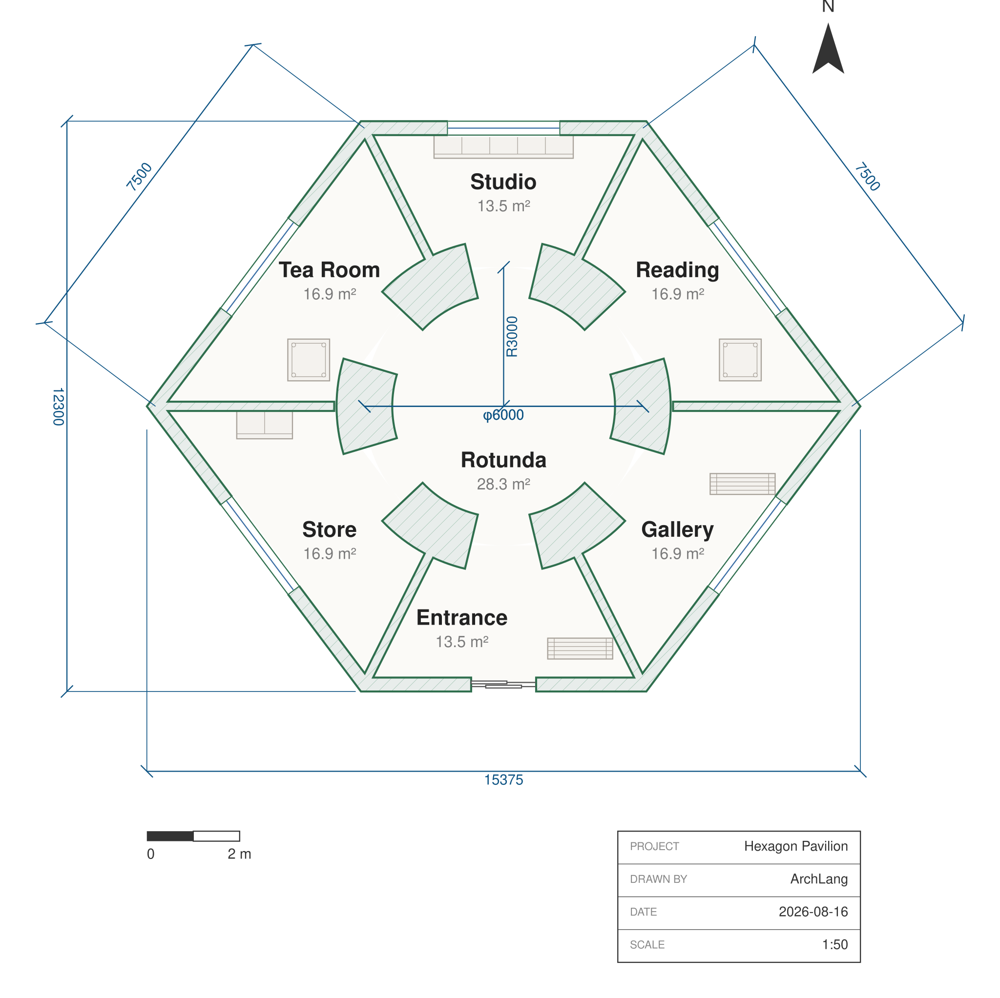</a><br/>
<b><a href="examples/hexagon-pavilion.arch">hexagon-pavilion</a></b><br/>
<sub>Six polygon rooms round a circular rotunda:<br/><code>room … polygon</code> meets <code>room circle</code>.</sub>
</td>
<td width="33%" align="center" valign="top">
<a href="https://playground.archlang.uk/#z=pVnbbhs5En3XVxTsh9iIpGnJl3E8cQBtosTGJHJga2EPBoOI6q5Wc0KRGpLttjYIkI_Yb8iH5Ut2q8huXeLJZHb1YMlU87CqWHXqol0YgDUVmBxyU1rwaK1IEbIKlZJ65mCGGq3wmEFuzRwuR0NIzXxhNGrfhoUSKWYgdAZzaa2xmHVbu61dGDRQ0oEvEJyYIz2u40Fyjq4NzoD04ApTqgymCJWV3qMGo1PswqQ5aQKPW7sw4eMmBFmYCgY2LV4LPQMnlnSI8G2WxBfSQS7V6uy5UAqdZ8kVegS8F_QJTN7a5UcWwnu0-pSFh5WKUGrp96o2ZG2YianCffgAXz59ho8QX0avzNUGUfqCrBCstZe0k32QGqR3jPvdr8ubEaTG2Exq4clSC2HFHD1a6TCD6RIqmfmCQdkqQdCbXhteDN-Oz9vQ2wfhoOyB8LD35dPnfYIVGkSWWXSOdIGL0fV4MHo-hC-f_g14h3YJMgOpnczw78k7xdTM0cGk7HWfyuzZhE1hOjJzYNF5YT0s0P49UKmdFzpF9hO6JXYdYRGMzdB2pM5wgTpD7RmY7oV07q90Dl4J91-DC7AoFFjMFaZeGn0KmTEWXEV-34ZC6hk6cqi_JzTJWRVGIeTSd0zJXodAH4IwHTkXM2RHGxcWkfyVIk1M6RnaThFJWlbG-oLEzKSeQaqMQ7UM8fXm4urq8upi9AreDi6urmF8PoR_ji7G112Y1DpPauXWsesrf-TAVBqMlTOp2cCitdsEMXsThU8d4J5cGF4OruAeMJshe0zZp0eODpOEvBE5-FYbeslJkrShKmRKfroovaNgN5p3fPn0mR_owkBR5AlPOpKEUXzpoCqEh7l4T9fQ8Enz6ZSdm6-n7MMc0YMyqVCd-7MKvFn9U7uPtDAVvrDGzPle4b30aYEabKkdTEX6Hoz2hiPaFcIiQS-E9UuohFKBXMi56O1g88Rk_cSkC-MCITXa4R8l6hTpW228rPlQ-Mg71lSPHPjKwMur4TBQjOPLnxpf8COMCnQEScGGZ5sGCy1hwpuYFXuQGwtlr7UbhDzkt4RXCYrOkTpaOcsUBp0IhdYmMp_E6Of_VyzIlycg8kIldUZJQ7MmQSzC0aYq0CKgchjclNzy8uXL6-H4GgZXQxhcXYzP3wzHF8_bMLocw_iXtxejV12YMJs5VoI4ylqxZMjb_g-3Bz_cHrJJBN2UlnrW2gVXzilrSd9t0kIqtDYeZqbWQcAkN3YCe6yccPBUizk-C6eQpxIzE3vIXKJt0w2x5UBqj3ZhlCBe2N-kHyV1vKFSW6PUf9mYrmRKgV4IPaNjWRuWP5AqRRMh5x4txcDc3KEj-1FQmUqvjHU9Hrx6NbyCi2tOtc8vL69eXIwG4-EqTgLVO3DSw3GSQF5aX6ANGYfTnbeIPkYeGM2uJh24gjx2jkK7xo2DYVdBu4QzSMJXvdrR4_L1cPyPwfOfg29zWJArCKUcOC-VgtRInZLdzR3aoDlTG9uGPeWYCMEZQJEW8HupmXchs6KKibowlgyF95TojAWLvrSaPE9U3nBE1DSQ-lIotYRCuGC-m_Nf2IRvXw9GZL_x-cU1_9PdKnKk4yOpymAjs12aS2bmY2ldae_kHVLmjoUEMUNVGEdxyyRiMequcCYpowoPAv4ohaWbNnnIBuwNG3ErWILgyUQT3gpJ9RT5L_t_WkiPqS-tUHRqiNNAySErTJEsWxhNdQ2LKz1k1txx6LZ2QYmlKX0XXpLKLG6Az-UdnoKSd7R_nQU5r2okP9Ked0AlIwfNqIBaUvi1dkPc4wYzspoUsnDUPYR5wBAzZrvmpqalVL4LI0GFgsmDNY3NujAy7CitXdDCWlMh0ZXQ0OuewDw4nCc9pWMVdjKDnEuIoKTCHfawsBoCjqUPN-PEMpZflO-IAGp6iMEXfHiHL8gZmJDxIUOXWjlF6HR-d0ZTKl0YyzkqbwxKFU0T21x4IrwdvSI3prsFJ-89ooZSm6nztkypjFZiiiq4TlMXpwWm79tkXqboSixdNxQHJHa-Ih_Ntot7LebGIry9GI2GL8JdTRgddr58-rzDRdB9e7k_aTd1dSD_1i48v3zz9nI0HI1jHbBWa54SN0qta1kjWxqpPSj5ntL8EgydzzGzYl9rZQgWckhrylnwnZwK13ZjIFJwo8ygHsOvZX7MYGGcZGqgxJVbxC68wjpl8hVaOSs8qUNOxCG7CpDmOzJZ4IaJL3COMFUlLqykfoKVGg3eDF9A_E64UNWIWL6lS6GNXy7I0xV6j4Fha69ts8XJZU0NHzuDCUyVSd9Tzp9TWAupuy1ufXbGkb2uTLUDH1oQDTCftwB24SgJIdpLktMmxNgQ4c57SUJMnr5vjFmXmJw209B5THJVumIC3jBoKHzoPi3kIqVeItCQEjrjJFQIlXcYV6Nz667QbQHMrMzgKGkBaCaectECyCSxX0nF0h1aoVSrBbBlY1pS6EM_AgBn8CRJkvVSeXctPW70iRkufPETGK2Wawx6J9jBAmrMRnDGOXATNeCEhHEKYjtvelyEam8rY0bkUIqQvL9SodqG8Pc4qT__Vmt204Oz-PivyW_1Yn-12GsWD1aL_WbxcLV4wKC7cBUKnLq8aZR37JpcDmLuQwlu8pBIg_l06K63bo_OuSUxk_ofEu-2B4_hplcvkXC3fVrq10sk2u0BLR0EwTqdTmej1-WV_-nV-ov-ukW3SFLwBcMZHH7lN3xpCnHB5YXQWZvYjlZDGR8st1DGN2Dng9evX8AZ9E4eAkutcY4iQcEUfUWsXZMVwbs1mcbnN3AG_X6SrBaHL25I0Ao64YHmm5dXl6MxnEHG3zz_GTpBkBY_wZWzzM5cgUrRQlP4wCoe-0cJfIijhL0q_s32aSXbD10hfNyAq95Rn0OTgZo_1uCIRD7AHonMWPyBRNv_CoXM8U5_CyWJO_eqb0G4v4aAx8EuDdRq4WOwFad0mZ1NMeP23UeTrL2c_BeGu7iPvhPT4T8w26k39SiaT5LVztKhgylmdMDmScGItKm21uZJ7ArxqPok4YudtU3wGHq9JGn3e3RiOIpgSy-V9MuN89j7as2COTfOq-A-ejE0mp0LpXZqJRgglTYtQ-eygV5XfP5rkzfowVtX6K95T6gkKvgB-u3jJ7Xl-MQImkkmrVhJhvvahZdcSPJQxeT5GtFSfxU7qqbW_CnWmTZDHfZwhnZKZrHQ0CbiKhQ5uApxEVJGvDvIlTG2yw8FgOws4PO1_5hwvIRU8uQodtMh8njmE6QKGm2AWBSWBant1-sn7HoBq8fzjzUwEplpurWCoWlWdpa9Y-81GprgEh76B2GA4gsgbloTZopZ1HliNDylQ57RjqcL455NwMfRiJKeknBTNjW9DPG1WSBfTuhbMhlGahE2zM9cXdJzJrm5eDE-50YjFo1iVf_F5zhJkzSPHKSovUXqirsPqEu-Hrynw4aKfr3Slg3XWGNdd-ELBqwVkNmZ4efW7OcI_Eljvl6SJJFZw4iCOEjqd0rehbg6Dk4QX9EXKB-s7u_h7f1GiycNxOrMb2_nO28IoQOHR2vec_KXp2_Y8CipSS9sP9raHu_1sq6cKIGFsof7A8HVdMi0XHaHmU59Yl1jcHXPewtxhyAi6qrjC-1HKOpFIy816mvPxG6t_j64h8zj6Wdn0Iu5flvj8EBgqkCc0dT9r039sWGbWApPl7EUPo3V5UJiGLvNUbiymc2TTYg2HoXRH4cIQb8cPB9GyL1YSu9H_gnTDB5xUWxw7K3qLTAWxFYxHXTOS6ulLy0yJQV_iGmMhtz8OchMUz9v5h0u8vhwalaRW4JA0xRE9z3y2bXc9tAplbAZ0B9rprh1SuiQ4iscw-DHhN2vY2gLkLpatBDfCJAdMyB6swhCbyE-SZL7J7FS2jaDcFIDxLcH8BoptyQ8PHoQr0qDK6WNWdfwol0D5BoeWfPHP1PY5AIg_JV6NTL5k4tivBOy4Mnqdq5NLnZqFx1vTFLAygzd1ijlFCZiJuiHjwlkaGn8tEbr3BfVzV8EjcOmDg_Kmo5mNbDmFiEVXigzK8n55T2rOLX8q0M9BMmN8dy2PeiyTur3AHWCD_9GOTdSH87mVNT3KOGT2x5Tamts9yCyp5EVxLf408x3IP_Y_yvk3ErqkuLb9yOf9LaQP651QPXPM53_68V4g9W8o_6h61u_uDAHlX1IqeN2cNv_8unzbf_xTTPIDV8w9O0hfXn4-Oaw28xxD3lCs4xlFhFsrsTsp7VJMJUTG73zI9cUaMze3_FD422vXbfm-1s7-s2OZH_tZ7rYePJq_cvV1s6D7Z0HYefBn551uC3dYdhxSGcdbp5FkwvpFcZktLDmd0w97NDgtBOmwWFqE2iWR8fvpkvYqX9_juuUAnb6Sf-4k5x0esc77DkfW_8B">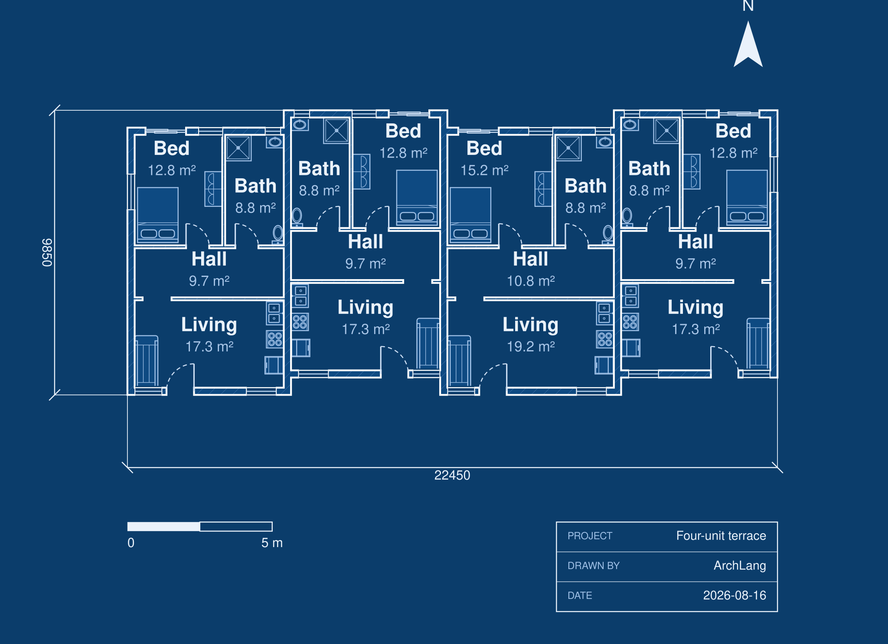</a><br/>
<b><a href="examples/terrace-row.arch">terrace-row</a></b><br/>
<sub>One <code>component</code>, <code>place</code>d four times —<br/>mirrored in pairs, widths from a <code>let</code> array.</sub>
</td>
</tr>
<tr>
<td width="33%" align="center" valign="top">
<a href="https://playground.archlang.uk/#z=rVrrbhs5sv7vpyg4WIy9I2lbkuVLZjaAxxYmxskNtjM5i4MDi-quVnNNNTUkO5IyO4vzEPuE-yQHVWTfJFt2JpsfsWSTXxXrXkW-gHP45yiCFQwHMIdFMVUyBiWnRpg1CKOLPAEBsTRxoYQBgyKR-QyM1nP49__9C1yGcPN6PL7tnr-77N6e__RmfAO4EvOFwt7ei70X0O_BxcfrX8aX8PP4_dvx7fXfenCbYRtKWhCQmGL-EgRM-FdEU-EEUm2YSqq0NiCIn70XAACTpVBqAjqFiTDxBDCZoa2WYx4rbQuDHf66ENLAJDBm_yJ-LYSRxbwnTJxNQObO6KSI0fY8NjFI7BBjV-9uLq6vfhpfgswZq38MK_pvDjHmzggFU7HugNUgHW1wIp9h7sBpEEpBqgtDKzwyMW35GPgZzbpavNAyd14OLjNoM62SH_zBaX-sTY4G7ELkiUFliZRC8Rmthz34Z_8I5gNAEWeHMEWl8xkxkGsvYCIYC2PW9BsbZ5gUCsHopVeGFzaRXxrpHOYgAvD46ufXtyBMbMEIlyFJV3g5uKUGi3PpN1v-nc3EAiFHTGwHElRyikY4VOuX_GeRC7W2MmDPjExgipnME5gkaGMjpwjd7t-tziffWZgEu3NS5xMwwjo00iLJiMQIU3RLxByks_DL-Pr26mJ80_HQVm-xp8QaBCwykTsyr0ybBKwzQs4yByI22vojVPIyuNDG8e-WQt2D0x5bOhAORium60yBoDCfuawHY8a6R1zYoF5PRuZWJui1KWIkBOtEnrC5doiYR6YFl9fnn67e_Uy6kAnmTsZCAUoW_VKs2es8todiiyEmhIk7xJjI1_BF67l3v0EPbl-PvY_2YLIQCzRwPgBF5GOxwAl8DxMbC4XQfzmIogmkcoUl_yLPtWMFMDRY-QXh_bvgJSUwHdChSMgZBaRGxLyDv40imMO0kIq8nc9K5CoD1HPLHCicYZ5MPHAqlWJhzIWZybwHP2mXgRNT0qMwCGmh1BoSNPIzJh3ItcukN_hY56mcFQa9wXlYUNK6YHQ6Z7uHBctTKciEizN4e347vr46fwOFxQQOJrHOY4OuEYBshkr5aJJgKgpFThuzg5pafQthnKTT20M-K5EjUgslYkxItq4wCBfnt-Of31__jbzJQSZIiwslcrDr-VQr1vIy7sBUWJkHm76XLs4wv7Myv-9ArIvcoelAamQyww5Ypz9jDz5a8j9vL8QAeypJDmI9Rwu6cIDzhVt7-xh6-xj_94c3VxdXtz5Ww8X5mzfd9x9vb0jrPghpR_rkz1JhDyaJnIMRiSws_EiCvEpegcXZnKLZj_mroErWNy1NpJijQwM_ktKvklcTcOIe4af3t69hhnqOju0tAYcrB6nRcx_IFTKky3ANuZjTSYMjXp9GUVQdkoMxsnnkZLxg0K0XmHhWLYjC6QkIRYlnDXaduwzJnC3r6Jq05GEvr25ur95dcNSDgwSTYqFkLBwmMF0HMt_7k3PUd5m0gOT6XdoRYql1ZMQzdIx_WEuDLSKTbBV1YtV63qEE491urhOEaeF8krMTtgcmhTYEXiccC4YdIuSWLGjLZogOlrpQSeDDx_6ldFlLGnbJNkWOm3ZKSa4h1taVTlVCS4Uhv-nSIUnUX9Dork5Ti46loykjxq5DO-KMluNKxE6tYZmtK8OMKYUYuQiZ_NPd5dXbu6t3N1eX4wloU_7m_S_j6zfnHyZUFTQJkT1Zir7v3_lDSwdzFJTurTfrSyRHrOQDky86x4llOSYYK2E4brCdyDxFY8g5yeYW2rL_duqcSaGFyO-9KA1VxpRaBEVn6wPNzS8csqdrh906bpPAyeFchvMenPuotgaRJLSYmbL_878T0Pnei-0UWJm2LaZOO6FgZnSxIHZCKcK5qoymvT2OIPvXobK6pj--8bXcPvy2B1DkJLT5fA_gBUw4_Y6iCcdP6EfRy40IxpIbRBFZeHxfc0OBEIZRxNYvypjGoCHMTVJV2GwCYiYoNTS2cd4BSifQ6_VGEcRam0TmwiEcDAfk0F3oj6LDHpz7AkGnjNyPaC1ZNHGLq4VBTtjC-URI3AWLz8UiBCofbKcivqcaT5e5XPX2QvUxivYAtpPiHkAjJe4B5Nq4DIrFHkDlPlTd8cJmMtuDkHP2mOtut9ulKqOIHeckLwSZw2QuqJoRCqpM02mKPii4nWm6_G_PV5Egk796OFwRFKcpGd_nJJdhFMEWBfgNDqJOdAgHoyiKmp9Y8If01_CJimeE3_0hbstibyFzLz_7EpZoHSzJzv7RrIPhH4Ai_KXX4HR5xxuqEzZ4JQv7DQ76JyVP_lPg5PcWCGPvABkOSxD_qQKpDjIV6-8s-HKPj1LFvVDx594Jk6q8LIv49nEMpncWnj7QqZesZ-f0gSNlQqm7_GmgwVETKXwLBxtz1viMxuGKq_8lF4a5D75s6t1RFJoM4ULm5Hh3MCAT6PSPGY_i49FpFP3l-CiKQFpGFzDsHnVHHLEps5FnJI2U5JOfbxK84YSS1KfCHnwS6r6Mr7R-fH5z68MFM9Q09EkcLydgitx6O-q-Cr7XfeVNrvsKrC5cVmaYReF83V61TYFpB4PRn-CAdx92YBT9CQ4IwddlJ_Q3Bjos6xpSyXcWrj---4FEx7mc0pmcFg6p4wrAJg4FP1z_2WXoBHBkEY7YrpKKs774b1sNm9ijqt7jVs4r2CuEf8N1yODsNIo6Z8ekpbLuIi02VoxqE3tkRTR4AsObWjCGHRgDsr_DXXwEA314BZ9lF0ZTBhsrgslzBUJRxobiRsAQ5iCkVQg6rxyanN1XhkrmXDxykwxzpNLM93KibMM3IhaD7fbNqNM_GkV11Arffn8IyD4BdNICOhlVDl4jxSLFO4SdcefoqIyB_tODLOEzzhaUEM7nM8UuMPsMsJMW2MkDYNaJ9KnQ2oqBAayKiE0wpafT9fPATlpgJw-ALeMly34n2FkTzH97MJMt4_mTYEejJpj_1s5oXF-IFZZV6O31OQ9sypKDa0YqonK1_oEmeYX5jN_Z0qUkhzUqaTC3xEKoLwgxhKMVOUjUAW-V4IUF3rKAhcXL1uUy4pJW84-BXzYIewctD2beuWjq-MLWN1hJVbqHeucZ__YAvnBf5QeY-x_45344gh8xJn81nGuBg4zbSKs82OB4s-LcCEpMUcH-mCqbPEZ4LZTa5700IrBAMWUNma8BmzTKwWbZCBKpVo5thLOSSrNk32_uOBnQDib4AKk4kyoxyLOZOoDw_IuPQwdcsUZKQhdhx3e27gwYXcnP1Oy18X3cCuKqfH8Df9gU1ydK0ee0K8iqFFdjlLd5CJFipZOqfquJ9LcPIdIGfINIIvPtQ2DzEK2Q9tghxuKrD8Fxpn2IlmE9IKkLeEOb9jcP8TiRZXy33JBUiA1MhI13xDQaRD7pOeZbRJbxNva8xj57HvbbNnITm32cfdI6Ed9b2L_hn9s-Gf7uTewJ832_wBxKINpxSmGm7wsJJm6dNmKGWz6Ztr1-h8dfY4oGyeVLQhvAraOlKZ8sTR88WJq27e5k0-6ORw3KjAOftLk3HAeYrk5TGW-eJ4wCGbpK95Xgjmu5NV0G_svv2i8VFVA2sGmI4ALbrQTE2KNtQ_jAG3zoqoygcFJJt96I9nWN_vzY_mC0f9G6omncuHBtR30oZ1rh_LiN2owwrahYoIRpkGevTsMUIS4cI7vM6GKW-ckkzRZsddVFtWk1BinvDnxOJ-pFnIXFYWbs23bfXzC2xViHGaAfzIV7gLLd19osxboHYzoGX1pV3ZyfG64tD5b0AvPQYYePpDzN_QWVOzqH0GywIqnbAVjKxGU0Gog2t4Ue1G8LX-iOI9q9janlW9QGT1ALrbPfFr48l9pyi1pzGwWCzW3U8931j_02biF5G3t-c1tlVYbWhJ4wFBRGFw5J2KQggk3u5kLmjUwdyrIaz5uFH9DYpZ_ZOQ2-BnlQ_lU2rzklYZ7WfD6quir98FZunFkPo51bWfQ--pZbS6pH7OGPC9Vvuwup1W8tO4qgk8fplge9q5q1Rov09G5qgcqcXh64QXr3mX13UW5v7mbSp6MHjMLHZfJ7i-azjL2f2nB1SpG1jMf-6k-Q39_TnJqsRafelDxNy3eyCoWfalrfwbJp-AY21sbIJFwLcnWul3mLMOhylMmKXgs_ZKhNs-QmcLElov5RbVJUXYFVdD1pKJq1gFjUJRrDhP6zpSQP0TTxOrHUWOUJyGVC9zdsuEx_8JDL6KLNkNeet3bmp2wW2do3DtXkiLe0oHwxxSBlk0iiGdV2v41CezZB5tsgJ0-BzFsgPuFucTKslXRGeC0Q3tNIrDMlvtCfu9_0jxpUmSd6yVo6btQVgRFvOJWW2utJhdWGZ6wf9LfWD3euP_u69UMuDp_PT9Tx_dlz8auGrl4_2L0-tATP5Cd4STRqeMnxk-sHzfU7-T9u5K3n67eV6HbrN9pav1tfX7v-eGv9RhRprz8aPLm-diiapXOl1WjHOsDPOKZr_zPUbDxT2FWpnoOV-Uxhl1oIXId7fq7-EiOWFqY0yvQX__YHuvu8uT2_ur77-O7t-e3F6_HlxL_ymBfKyQDCwL8WaP3TjDwJY-dUGhoVoOFqxTqqIOmeyDXqFXaLwXGjFTmKohW3C4k0_pILFX4WzkcoJdPG9mHE20_rlmAwiKIV_dcQXypdly4-vzkevYByNhKef5jyJU053OUXNjTbtR1-EsVr6_cAU77GVShM9ZJjkUlGjoVSzGVZ0nP1UzUIJMG0MLnkS0T_hsLHLZIAjbAPQ8MVGtXteQ5v2n8MJ_LN66CS5Nm34JwefSsOn2sQnVY4T52LgMhGyBWiXm8UWuAanLwqrYJBx6fX70HCn6FxbE51q-OaTGi8uXlskzjaQaJ_WqOTl3fYvesBhm9bN7v8h6gMt6g0pFQTCaPOs9qT6JSrQYPMbSnwZ4INhl8L1hZxG-y0BhuGvr1q2mXs78a1fljS28pM0N77EHDUELTXa4MS5SiaqJSULtHe7z8fajCInoT6Gn09QGGD1_7xs_W1DXb8HDAegTRUplNRjqMGfsAyqoMJFQmrs6YzaLOGKeZxtv8oTP-Uc1vUiMqbMCiczGePQ_hy7Kshwju06qkHZ9NqiBAe7HCdwJj0aXVSY47zXwtpJNp90mXVHT-JHxqRgD98FP8GDd2NB3Ta5bPUhXBC6VlRv8mz_GyVurMJIU1eVg_fFobHR_6aeuGyqqVjXqrXJ-WMh94WOzRdVxj_eIAe3tWX334wVT5aK9l4LNmECVzDkY_bSvlgcLG_c_PR8Vdsbj4ybMs89GXhhV-_FD1HHRZu3fVta8-Plp8BRxw-DuffOsLz4UaDXXD8ZBK-Au74dBOuhbeMnwAalEB9zoSMFJrKP4QyjP4TKEeP88LvTzd9j8cOpfpPo2_YfNam_AcPMGqizP8gyEn0HwA5fZyTB4Xhb5RLPUTfsHnQptwcuSO9llMyls5f_1Z1r4UDi76YzsLr7fJ97yFsVeKN975h_FoePwp_rZ74VpegxIeTTmFI0Auj_46xe-SNIi-hlii_m65h_9zE2Rvh8w1AQi8E9wfR4LgbnXb7xz6v_r73_w">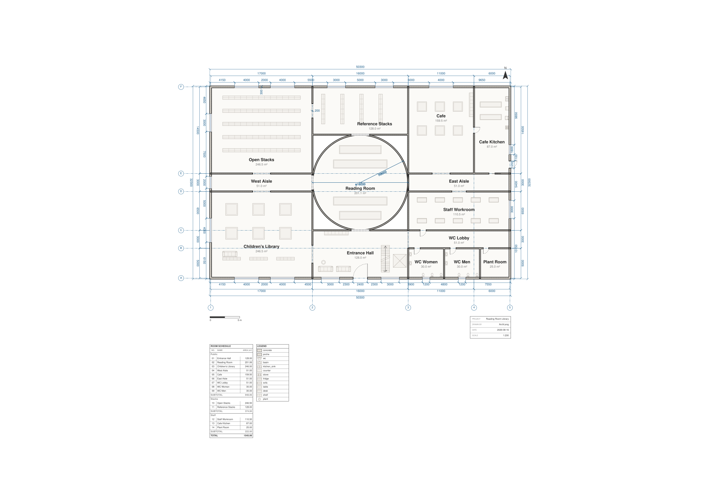</a><br/>
<b><a href="examples/library.arch">library</a></b><br/>
<sub>A public building on a real sheet:<br/>A2 at 1:200, axes, schedule and legend.</sub>
</td>
<td width="33%" align="center" valign="top">
<a href="https://playground.archlang.uk/#z=rVprchu5Ef7PU3RRP1ZKSO7woYedtatkWdlVReu4bDmuVCpFgjNNDVYYYBbAiNImrsohcoYcLCdJuoHhDB-SrE34hxwS_XWju9EvcA9O4UUCdzBJoIACvTWQGp2ayjoEVyrpYX4P0ju4Fh5BSY3w73_8E3yO8Obi-_77T28uL876bz5dXL69ePc94J0oSoWDzl5nD_6oERYi9WDstdDSoWO6ZW4UQqmEfgkCvBXaSQ-5UAqkA780MK-kyqS-pvXCg8uFRRBgjVkM4CrHzh58evf-9OItOJkhUTlvEX0PhM5A6HujEQpxD87TF1LDf_dBYrvclK4Hn89cD7xMb9BDIdJcanQMDATa2VvBlkr4hbFFACbhjVb3sBT3IFJrnGOJc2y0M4CPhr_JrFhKfU0LBDiprxWJPU4SKAoohfXSS6N7MFtOiXjWA1tpTRREvaiUIssUsJSZz3uwlD4HTeqfmRJp3cxBWek0R9pgZw-CqQTMFsbOQBlTvgSU17mHk8CU2DjeCKlnOArfLmmrQjqFA3hnfE4SoHIIPxmpeXOdPTZKLtQtupX1LXohFSlelivtOLS3MkXgnc-Nz8F5U0KGIgPhgzWXQqngH1e5RQRmSYykq92n1qrLzTIVDmFh7EsmAZj9YjTOgF-0phQyg2-h0vFDLUJwXung7fnZ5emH87c90HiLFqReoLWYwcKagiHbr9I4NswALjzb0IGOWtkndh__9D2Bzu899mWG2stUKLaOqTxIf9CDeeWj2tZf1pgCHBmsUgjX1lSlC6crWFeAq-beeKGgRAu0z-B3swxdauUcod__yRk924bG0ljvgnLcX_46C95uoJubJRRVmtcKWihjbNSvxW5wT4si69E-WYZiEBTNpp2tFL0wla2tXmkKCXQqyZXmyqQ3gZ4X5UJn_VKJFDPetBvAuWARpP_GbQlvFguHvrZ5fQpcVYBZxDP3X7-b48JYBOl7tK80F_qalgk-0984yLD0-RZ2Ychnye73zB7mqMySVE6K1S1_D5tGlwolvLEOYLZ6gH__41-QSQtV-ffMLPUsmAUV3tLPs5UmXC4WHlCkeY-dRwfL7vKGNMdba7RbnZ1P7799-w6EtWY5gD_qVdToO28s3nPApIUU1aRSjE_EW8jhZzN33laph1TatFKCnPp3MPs8_Xh1evFh-undj6dXZz-cv50FFygq5WXN6ucKHa3fgmal8SlaSIsOyIcG8IYOumbJAXXmyG5CN7pk9aD2VqKrTz5CalRV6NqLWAXDERQQxK6sUHBtZdDNTNyhm8G8ms8VOtCiwB4o8uf5fQx45PBGk56dFx4L1J6PkTXL4JocCxE1pMbYTGqKhoMOa7V7FZPQD0KpLvytA9HDi6IDsAczFuQwmb1sIncQnIKoz2V604TAHJWCSZKwnwpYyDtfWc53dB7EtZDaeRAMvBApghKsM7L4YDA4TFoCgoBhkgQ9pKZSWdjJXWnRuUEHIArWASgF7fZ0FOBSUWIHgCyAMHw5SmiJNtbnUJUdgEwWDkTlDQileGEMS3xeOx0AhR7enP4ZXnGmSNj8e23jzMV9kxbFnXQsTKT8_vTqnEgnkXQP7uvTvEqVHVZBv9_vR6XVYE2p0X_WqwOcXEBmrwIg3nm00thgIo3OkWGgEPS1UFzqWPQIf4P9pJccwP6LJEnan0h-elp9SpVxCF9arEL-bhyjxYyyPUOTOlaY4eFLa_sxNlPV8XI9se4v0fmD3fl1HwX9tmv7y2lAme6WaxTkYsPWsoWHuMv1_dnhYyhJb5QcspICRHzagBg9AXGctCGOd0kxfhxiPG5LEZ9Yyw0G6W26fAzn-Kilk_CwUyeM9Kh2T1rGjg-7kdLl1MHTSKNhUNGL9tMmVPF1UCdrUCc7ocRXQY1Hbaj4tA7lvFgspu4rsI7WsI6SlQUp_HNYBrijQjLphajUg9GE33hxDyYn_HbEAHAcljAc097XtIGI3awHk_h7-0RyGHxm-NkZkPbg91t1EycupCNt-I1KitAZofOA2TW-DH0GNlUTvD1_f_UDSMeYSyu9R71eCoUCxJTPKXpWVR4VAQz9_vL0Xf_y_E_nl6Gu48QqPaRCU-7RJKLU3CCJuhjfP59-vPpw8X767vzj1UFde9KObqRxNyFVUhFEDEhMLn5DRKsTj5LOcxYkDZml7oFYeLS8yHOjQLwyqvOE9ZTeOQGGMMkaFL4JtdeihCT0TjF_Be_hGlxmr-yUNDUEJ39BODpMElBijgq6fyCBYdiFitpVs1jIFHdQjh6iHD1FOX6IcvwU5eQhyskmJXsyqSt0R933QmbdLQ3wb0FpyUHA5qNyF7J2ZEG0cFbPBCInbtZbheUaz5jNup_4fZtv_J04tzNQ2ByxvhsdtQQIME-LsMFFmfmcz_taSGcm2zwuaXF3VeYyg_XttaGX6XQJDN2O8Qw9ZAUet6A_n8FnU6DutqCX6TZi0UaM0f1hyB9XgA8jijXEk03EtpFP0xSdk3OF8Pms24JsrFqXHt03Ir2hWi43FRlj61xRtIc265gUHmD9kdd_MKbo1pvZeQJSo701qo179BjuWVwfkHecjxjp_5eCcyPSz4yG7yjvvSYpvyuNez0DL25o6gKXF1fnH04vVwOG2B5co0YrPHXKlSa1hilNFYdljCvmzqjK8xikoODrUWQvw_TDSM2tc-ygeCckwjcOUmq5kLc1v6daNxTvwZ_3YP8eXnGdfhCnDJyx4zSKW6zQkOfG-QGc8ySJ52nCZkHKHv0eM1czReoAyQmSxm7JYHASPSROrdh-Y7IW_BYk_IYTeC_IEeM1jatasrC9GnqZvTL8_ZR5Gh2XEfDkBdUTTdTfMLOl3BW7EGtIob_CzBnPT7JX2bQQMiSdyWGruAvc2RN5E6ETcWEWqL2BOgB2NjcVMhJvaFW9Cw_j0WECEZaUtYtstE324vhpsvE22fCI2D1ONtkmG42O18k26TgcT3WgjGU4WYz7w0A3TrbZBTK3STbilL7OrjEMx-eGImjxsGFEwWLdIkSxCVFsQgypsXkMotiEEFsQR43cw-EOCBFcdi3GxhBSGp5XEwNHg_MJFBCSHA9wfq6wivNCjZKme6BQLMIYfIlYMjBzkp7qPiUznFHUcSCUiXPnGDq8FbdonVCwH4YG3oAzlc954nPAsYuL01JoVIycWUlVJzPgws4oGYLaHP0SY5ygQTLvAKxgGX0u-BAJSI3VaAdrOqyTSdz7hjZHSaPNF6RM2hJYilRrKHXqeABlsgtF4cJvizKlkBqqitiknBw2h55H6luH3lS-FYeulfiFvv0_NBZnlfVC6j5znIv7VRII5XK4EqERk8goVseeAYSLC9j0LTMwqMNb1DwmW43RaHzLvURIKK1sw9t8NNNsZoNJzAZLqTOzDDXgYSsZhMZtpdGjjTAap1AUPvvcggTvDHvcBKZG77jBPmpZarwLN_YmNEbjtqUX-rEV-JeNvYx37OWk4feiaS4f3s5ePFaBSeQYUxQpVeh0a1-Hk_-RCc2NdjDhrr2tvuPkQY2tLw1n4ZnLh8cPH51d60eT560fT1ryDA_X1zcH8hZtuMNp1fuxIw-BrL4DfHQc0GldHVC8QJdOV03pZMjytKrVSZLckZR8qUDrdtFXZSyjJ5NH6XmgW99FAFErufBTkjv4C-WtNjlFvLs6bdYT2DjY5dEDbszQw6ieRunwZFxqn5CjeEIiPQlDI-Xgum9O_9yD40aqkyS5O4mDmHWYw22YUQBoQ40ewGrtUWjphb2vZ_K_bsATSv16js8-9Z3MXtfXWN8VxesZlJUP1XMpMcVvHJydv7v6cL66BM0kldIpNqk3zHWEUr8L18d0nUWY4e5NpMjVNvxcCevR9n1lNSf7fdKUgFR4ocx1RfeaYXcHK9SFMb601CjwPTrdHSFl64zzuDZrFw48IaLuetFvxnTSrdIHX_k8ENUXldWSbzuWKaxpqB5zRiXxcQy2449SN0XYUzDF0zBF7UQroLlwVKyvY3HbUGOdcKpoC_Is6pPD51GvqWONdfFM4pPDB4mXKV_abRKLDQ3WxOJrOLeIx-vEzUFr_kKykL5PF-O_-qBdrf9LA-ZcGddF5qrdrSuS1k0KjyFnQdRZfbtcn7vQV6-Vvat4v3ZiY29MUWXGd3R6dfZnYSnfnrsW4F04vL16BnoEBcyFvgFXCu1geNwfjaFgXO6nHZed7aM-WDNEaipNk9Bd_hctESrhMEFLQm6o5yAbCuwGg8UW9Jlsjn41m3DlK5yr416G7gYczXp_qmjo3SpJuK8ntj1IFQpL34dhdujzy9IakebrSmK8mC8Peao4DAVfM_HjmqEeeK0k6YaGC-mfNC78XcXlxjYFUp2Wv6WsGmfi-3fw-hVwXq89b-V3B09Hxzlx25qEhCuMWLY0ifq4kZql7D4I1q4-A9ghYz0B9mVbkTxkG7WqKEYYb9j8LbqbaGjujh7FOfkqnNiqUSzx0iuMqiut-QlTD90f-S9qF-SofO8RTnkTbxTeogoa4v9fTOf30D21aX4p9HX8npyoO0pGR_3kpD88Cir40vkP">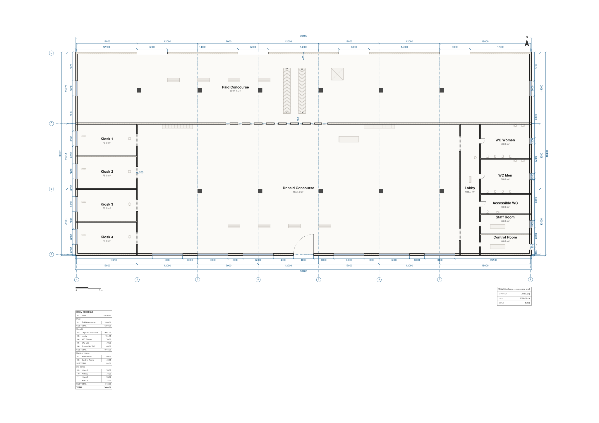</a><br/>
<b><a href="examples/transit-hall.arch">transit-hall</a></b><br/>
<sub>A concourse: paid and unpaid sides,<br/>a generated run of gates and kiosks.</sub>
</td>
<td width="33%" align="center" valign="top">
<a href="https://playground.archlang.uk/#z=pVj_bhvHEf6fTzGQEEQqSOZEUUqiNAYYW3aMOhZAy0mLIBWHd0PeWsvdy-6eTkybIg-RZ-iD5UmKmb1flCzVbvmPeNTudzOzM998s_swg3-dJnAL01PYQFEutUoBfy7RqXIDf_z2O4Sc4Onb-ffnz0Yvzi--O7-c_w1WGtc-VwUc3ByNJ9PD8WB_sA_nN-S2IVdmDaQ9gTJAt7gpNPnPQHlwlAallSF0Q1hSiqUnKE1QGgRGXqXRrEtcE1ToxzAzg_3OHOVlybJUOuO3hG1BEHIM_J_XF5dnoIKHlExwVChKiX9HSLdamcypFDUENNewteVgHyrU14DOliYbAppMNtcRWDlrAluxtJUfw2WuPBQa2SFyqfLkYWlDDmnpbghW1m08Qwz2wdheBBrbDFVnEiIAdCkc3A63h-AwU6WHOfyYVv9M0-on-HGD76z7iVfVIYcfZq9ewfmzF-dDtmkj_heObpQtPdyQC3QLwQryh30Cu2INAWpr1hwd5VJNYFetQWN4RissNZv-UcgEG2WsEx9D6QzHYZGm1QLQQ-awMmPBc9ZumvdigIP0dpj2AxI_CE9fzp--fTWbw_NXFxfzMbwMHtARckg3hL50lHGKpUFvP8LQg0LN_z45HIKhG3JdXAN5T1pjUNbID2unso_A5RzC7B2mZNItaNyS81B6itVxWVmQ1PAQLDjCDOxqJe_h0CizHsPB0SFc5hTTKoMVpiQew-X87TmH1UtJvvn-BSxmi8E-pHazQZP5ITz763NYzOZPF0AmqKAoLvVW3uBsKE2Gtcfa2msv6IEyPgE0W_jF2g0fz8HkEBaZ4oQug11AisbYAGmOynC6sGlDxlUBMrUh45U1vn5LabLWyZxreAsvvvnscrAPJ8lRMoXMkj8DNLCYL0ATZuSgIAeZ8kGZNEjqSBxhUeSK3671yJYBMHXWR1TOnFKjG-xLJg2hypWmyB7CLtFYDz7gFuqz9MGhWueB3caMPFQ5Odm0hSVxLcRjeul9SRnvmk04NEdnkyQZxvdac8PBtQa1uMWV6MmEmDErzvyGQDqOyqWIvPqFhlCpkMcStl7xJl6Bt-TvWemDK9NQOtSShWCN3o4HQkF736Jb2tLBrObFPfjHAKA0zF-bzQDijqMkGQAUyOGdTZhXM59iQQMAn6Km6NkAwFgXciiLAUB77IBay8KcslKTxNkPBgD7MBqNRuBz0voMQu7oPaHlA2SKqdOYv47e92E8weSc97YM-YjQB0itM-SE7ktnOEWZxtnbQK5HWPOjSZIk4DDk5JhsDWxUYFL447ffBTh0xXSX2VeYxvMhyGNAx7BgrirKUOeZNJLmaOYvX3x7CXYVcR3ekIaDmORas63cTyiDg9MkSZLh5IskSQ5h9AQOpvx1OOWfD4eQE0piRH8r8uFQMjjNBbnuccp4lYmT_Y43bOo5Rlq6E1y8vfxhNn82hjcVFlyVwTasK9VIgutxQxAqC2SywioTPKzVDTWJneINtXE3PhBm4wHUvmVfy3kD3QZyynKoVXptyHs4ThLJPoCDZJgcxm8xArtPMR7yi7TAflAa5o_HmVYNXvyvPKXaenbk114Siul3evuZZNuq1LrJk0jvlQVPG9VQR-TSe0noRDEYjh-_bzFCM2JrucFzHhSlK6ynM-ZBXpDVAoBP36kQyHCqSi-prIDmqG_I86koXx8zXBMVHpiJt0DZmj71TQBulFdLLcopxJJwKY3hG5YaGNlKULO6P8sxt0lxJxGllEZPYqLxF841_hsLfvREVgx3smTB3E2LzxaeG9KC8w8hs9ax9ypI2_KAa6bXAJffzi4hU6LrrJFk7dVFQLMmEwQXQ2x01roKt4fDpmtzuFSAypZaOBc7MnGlGe8QRH2eXCARmRO9SV9bOi9igkkweixZDgfHMf0mkmjiq23dZT4NUY7UW2Nsdraexrr1tgkFBiAllCOkGu12hFowBW3JnRDdVl6YWmMoZVLhLCy4qfdrq-nNBbqgau3RlNekK69jKZij6W4ZiV_1r00W8cJuRX_fnRX9YrrXeR7g7Mc_PbfaU7kyD7vGVV4fzcHkqHdQv74fafIY1PGXPYCGdh6D848bdpz0keqnFumRrdGTh336rz7w1h1vPvytp9HmuPv0nvMruyV3VT2K03e3fpomDyDRY0jTHaTpLlKXeiIu_pdsuycmdoRr28eLXHU68uJ1ZCKFGwrkWNk5W67zfsdn4RypWtU6UcBF8lXIrVMFqexWQ8aqN9xjay5jfqiUJ1jSGL6zN43WeD377rxu8pEZy5Bb96mHd3YZeTO1m0JpcrVYd6RtioFlVae3mcQ2eF2_NypPjUvSQlS19KkHPR5dlREZtbRNx4-OslyOonQhu-GP3_4NGBZMT4Lc0dOV609skRnvk0o0AvYuUkID87h1r78lOeEtJU_QeRSZ7YuIVvUgFbj8YvLKh9UzSH7fHp32XjPnLS9Qa3LbPV4ouFpxtHvI16SLDrlfGg8i_4W3PLeOfBDgB5BjA2mQ27pvbT7ioNwKcIP8XOngZGKIwBG55JuRsO1B73S1jiZbaGGl2y_60E-bLTVyhK41D7-xBy_l21ner9QYE4Fnh9qYnJvg0KQEz3nvXg3PmdS32-e26B9jDdod433gN7kt9vqTtADb1Uql1I8IrqhDnn6IyU9xRfeRM8WDV4-BbEFGhtb_m4EEU_Ra09ZZMnjwqqUekYxjWFjTrsEAfy7S8GQh2s13am65hfnb1wKqyaxDLtyERlp7ak1walkGEZhefqtXzf8Ucgo45OuoeCmWW5c1NwKTk0_kZkxwm7GqHjV4ZI9zfHsvwpZ8KtO0C42SO5-9uYwyaSzibEeRRh1UGt9q0FZyNhpUJNqwZwyD7oivOA7jahVFlzIh8lpXP1HOfX7ySSOWQy6EJ1vrcS9q1_qepa2PQya4CJt9nV05G64M7J4Hm1WpLOQyldxb7u8s_7xb_kWSDFrRuuFbE2oKR7WDfn29F-e4oVw0nHzSnIFMWzwVlKa75-LjiBNiaM6i61OtEN29RJCQ8PF9FRshKjnnet4dyYhZKZPZygs0X4RUkqs1FKeUCp70Sq5AlIMCDbciuTzsqfxmilAO3uFmGSca1LtxlmB0vaCWAjFsk2mSxJyPs6YMIKCYsqKFDFFdoUuP2Li4CANMP28CP4mi9s7qyc7qk-T9q9moo3pqrRewjT2DdteefMTatk9-wNrTfl99__oBNHTFPtor4dseh5-8N6i17ru7WSi1x6aPbaa7m2ML6c7zuH-e09bsnt6-iyAtP8b-pBO7d_3u6f-7ANLZxf4vPwxg0mP9u5dwZ5LQby7nM7nqed8VHDygO2f1RUCOcn2QYSg3oq6am9IUneM7WWMNfSUlXKsmFbm7VXZcMXIjGMe-W_Yu6b6KxOgeRct0j5I-8rjt9snXyWTnP8e7C6dJMxD-OvgP">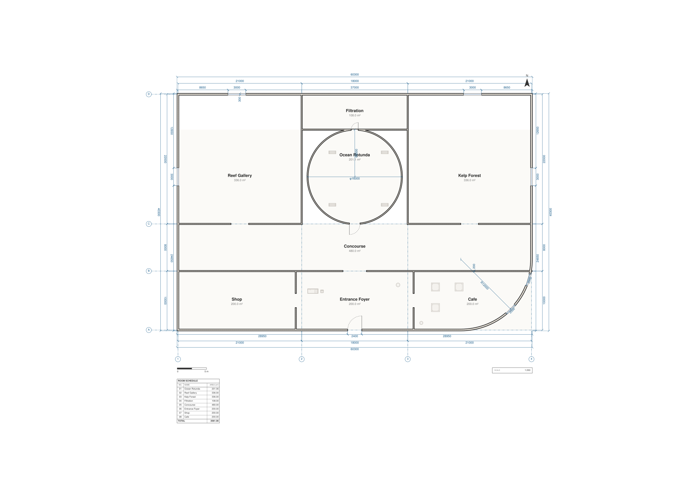</a><br/>
<b><a href="examples/aquarium.arch">aquarium</a></b><br/>
<sub>True arcs, a circular room, and exact<br/>πR² areas — never faceted at any zoom.</sub>
</td>
</tr>
</table>

**Two more, drawn on a smaller sheet** — the same language, laid out to a fixed scale inside a
titled A3 border rather than sized to its own drawing:

<table>
<tr>
<td width="33%" align="center" valign="top">
<a href="https://playground.archlang.uk/#z=pVpdchs5kn7nKTKoB0sRJLdIibIsr3dDbWu6FeuxOix5HTsvIliVZKEFFmoAlChOR0fMIfYMe7A5yW5mon5IUbK9oxeRReRXmYn8Bw7gAsano2N4hPF4dAYr8LpYGhz6YB1uILeVR1jn1iM4a1cenC6WoAqwJRaQ2sqFjXLZqHfQO4DbHNtHoD2EnIkNQml1EcAu-FFpVDEAVWT8baGdDxByAg4WqiJD5wP9qua2Cr0D0EHAVICrW7i6gU_Xt3ABn6-v_zyCT1ZItYcMU6McZqACHE6TJBkcT5PkaHg4HtOX10mSHJ0LWu-A38280Yd5pU0WYdZOlSWhOFsV2UBEDZbX-fuNcJ4qY3h9AAUz0s0M1jrkvQP6Xnn0M1jbymRQVgEmY1hNSPw1qpCjA11EwIWx1oFPc8wqgyP4SlJikRrr0UfJVe8g7guE3CEOPS5XWAQolQs6aFsMYLa-Y9XPhD18QLeJOiVEhyrzjfLhH3__b_pCuPHNA5hl6FOn53h4NAo2KONnA6ZItUsro-g9zG42XGhjGMPrVWk24BE9FDYKQwJitIhfLuFPF--vPv0Mn798vBzBxVMD8bkqUbicO1T38rRQ-gFhrTakNVX4NZLl9Q6gv851mvMvmUVaTFumi8yuwVh7_-_9Edyqe2w0creOcsRFthCpaj5ekTF8vby5hbUyZgS3xAl9ZFtA35htQzEAb0GBq0zkO7Wrkg2v85poDPRkpbPMYA3TmJqYR8pvCvym4UKluliO4Ir3vbDhnEmWyhh0m1c-apjtN8rBHHqdRfya99q72HiVJpqaApUPLEKHW9IcgV5e3NyO4MKl-UfFjk6KZzucb6B0dk6M2wLlJSHX6X2B3oNdLABVmsNCpY2kgs36tesCckucRtNl_tS9GCiKAIXlIAM2TatSox-A7LX2gI8qDSSAareBXK3I5KE3llx2oVKVISij73EEn1FlzLpK73k_ztkoAZRLc6jNnbBXpUH_Lw3ykOPeiJcNh795W8Bw6NFgGqJQnpHo9R0zA4eldcHDrC8b2T-HPmm7P2sd9A73r6N97M_Iq3oHokraE9LPxfvP1zc3uybYqGZNe-7tCmlbOHByiKaQiit2TfHFv1x_urwZwexvtM7oB1r1O_zj7_8DfxB7_Lh0-kEFbJ6LhPyTR_eg085PS2erMkYR3jYfVEDaXC_hba2LpSeXZ_pcefjL5edrWKJdYXCbcwlSLRnogs3AobfmAclseNvNBpQHHW2Kg7ODNTqEDA0GJH9UK1KOdZkuVCDL4Sc68wOYbwIOdYZF0KkyvQPInFqzl_0ZV3N0Ptcl6fHD5fuPF58vPwygIMZAFwt05NQLZ1ewpqBGTk-S5sRD4Skp-P-zL9mzzoZsxKZjaIU5GruGVBWQKuc2ZK7VnEMssChNlC4sqJWtOFP2DhoDkL2s-SYjMBnk6oEU4PQDZiOYbZv0rtHSDvgZOGtMnfqUQ-WhKt_CbDjsbv4sJgv2cnF30MGTC7dpPkYkiSoIv15__K-frz-xdgYUtyRRgcM0KEpc_hwUfJHdq32-zQS2IP2hhKUq5JLClA8j-Op0CBTCfA3JZQgFTFZDgRx26RcKdWRyMMewRiTMUmOKvo5H0Uqc05l1bQHS7JMgGu0DhxlZF8GDXqGnwEz6S7EIzmqKN8aQte_IQ6mRxN3KcFJFqQd0alkXRKS-KrDVN3YUA7NRc-QUVBqVYkbxNyeO48uintxK9uTCeAtkoucwM7gIQ7uIzqvm9gFjBgxrCw4llSsDmab90bbg5G25MInBEKiCeds7gJk3mgLKDDJrnd_2A8teYOtaplXAoQKDKuYjz4EA3iQJrFYcGrhIGk_lQceUIlUUca02R29jiEeYlTa9xyB8wELqDNlSsmRbjHpc2vTfN1z8QlG8D7_3AKqCTHi16gEcwGzpdAbTZHbeVlCeHALGSSJJLab42cJUPp_BQj-GytGmFOwZoGA0Gk0TTnejHkBE7AGUinz64ljWpqrEHoBPlUEYn48TWlJYF3Koyh5AplceVBUsKGN4YbRFNvMegMElFlmP-b7l8s0GikgUZVkBwSGGOrVTGTOCmdfkxhQvuIigMvAtGVihVuhhoR-Q8Tr7b4u2_nsSPQSO6z152-HXo4Fk1cPLowHgXysVrLsjO2bgw5tBFDJ6XlxxNABfFU575LVC7avCY4gPvh5RAYYb3g0FHz5f_On26tPPjPrL5ZfPVze3V-959xXFhBLTcN6WK5RjCkuIsLIZGuICyNxDRVVBkdH3TAXeMpIKfq9F4jIqx5X2JVu4sP-HKH44HA7B52gMiU0mUMeO1uS5IBp-868HsbbM3jEg4GNAp9mc62LqOEngdzhMBskRHI5PqXdpP43Jb47o1_iJW4Wa09u1hUVlzHCts5B3zTuzsLJtMbu27v6cHWuOuY7SiNBzdrmFmOCAYWmdLsTummjKEahePMeM14_gUkkaVHXPwvLOMVXUS3Jo04XYifaQ2iLoorKVp3KArNhWy1yKGk3lYqkcZXRIc1Us0YMyltuuUUeT6zti465o5e1oc1Jr81gUJ2qUL388BfEvg5x1Qc4iSOOdneYmeDSL86ZWHsQ8EutfP4CVDrFXnduQU74p0PltsRjvJYbaLjd-5iYXuh1v_eW4y-x4mkieHicJpWYJrhJbKaXS9u28FrDgraGihzi0ay4LSlWg2eZ6qczdGvayPZ4y28RLzTZ_PtuzHQSDz8CI9ONJB0e-7AOibL15EYh5aJjZZxuZptriJYw3tZ--ec6-7nVI8-8QqJVmv5WGHL4D5TTpWKp82QHCbPwy0LTVqHyOIecJzuQbDI1bb4lfGqQ2wEq8kb4Cs04PQbUPNyGz7wuw3Q6n_1H-E5CUAiC1i87eubu4iOZFtQl4_TcEEvaRnsQyLKL0geuiiM1YB516iys1ScticmqpdOFDDHr8Knr3qzhX4F5ZijSjlzRjKmcRlEIkI2kXozJmFP2qkvMwJTlMLc2hmqZHRldcLUttu7IPsdRuQBsW6MctVqk9jlG1q6DoOlFEaDVWMyz6Ot7V1yXR9UVbgpFLgdMFjz5F2q-dZz_aB14Y4YSqF2XqNCPSYsjUbjs5c93eVu26Kdnr6Ug9DqkVxa9tSvSlpsyEj6XRqaZ29JBr5bX2CLOvdzSHvPt48dPlx7vrL7c3Vx8uZ0e7eqyL3NKazdIW_Ctsx8EfDeU1xrNBsBNZ49qozp-FmT5r_ozRX0-TI1Fvd9oX94yddGs-0P81ftjvVhxZCLxmhf46jpW0W_uT1A0wjrsb64ingBOZ6rbifQNw8i3AYwbshiYBTJ4BPN4DeFD3V3WrJ01Ugeu2uD6PdXqVbajm9PEXs-Gi3Zad6gnGgwgbG27IsORWQYYQMsqVCNJGhYFEEwkQ7JiY7dqfvJ55hXp_2IXJszteN-0IfkM0UWi7WOgUt2yhHgj1b-KH_bbASY-8LHTSW20OTzz9P2R1H2KkjdS7uycpsIN53G4gY046mD-pkBNtHb2JegewCtpsA0rC3A_4JWijw6ZhspLvtXZiOpN-efhP_knDyi006GIWm5jQPgoWYpieUQBs23uzGcbRgchJ5yNGz5HKabNhXDpHUV2oGQTllhgGTb1OhthMcWRM9vnqPy8_1EcIPPvWhsdYxhBrjBxneNylVSG3VOmmhhHrpEhFp5eCQcsIvQo0bbMONrYawXVB1HV7xKhx6IxNLKY2pjlIKI3SBRfcqtis1eYcZqSxZgiDxryiyL-m-rxu3Lni1dm77E6aG4laY46H0kNRgJA3S8NG3TRGv4mKk12_fjIHoeEnzU_QNYNaJe1ZjnqZB1gql2FRT65ApaGijQPtOYUzrJI3ZjIb4eZUBlV-jVgCag45nWMCiLORthmh1sPn1mTbEss82kAc8VA8ajopFeCUBRcdnCWJSMKC70FZbqNI48Io0wZlkjQojsRv-yYOTwM-RVCtGIXZwPh4ylOiNVHFwR5vHk-WY9tyj1h6aaNojOAZNzWo3FsZYMUX0kxE13UPNy6xi2U3moxlIEXx2KjiXjb9kOYm1BEx6Nk0Ycuv4zPppTQVtUu_qdX8aBAHZLNWWfU5oNIrPi0McXOo3dveDwnSUSZWo3RSKsCk1eLZUyW2EBIZG1rkLXg9TQC61N3QEaNhCyGxcAfihLbuOQii2IKQRochYs-jAoyZDYF4swvRxvmOLNyftEbpmZFp8jwKUexCTJ5AnCUvQ0x2IY6fQIxZmOchjsW03yuPWTOXlkKgrOZGp_VpOp9QEZmELSkfuBanyRU5PMUMww12HSV09s7WhXnTuUjEqt11Woes2PzuUu9W3tvUpy11LLZ3yGODT-Qnk2mdfWvySUsuwWQfOcZkS2-O9M-Stzk1Hr6d09QcXTzu8_EKwY_k1HjsqbN3Rd3SMD_1sI3_OlGrjf87xFGTIkxCwkTqXV3uI96qjViT28QnzxPjNvHpk118w0b-HPFWBcXEJ13i0xeJt6olJn49-U5iX08dmHhC-oqTgO9QmK9HDdK4TH6c-Lhh-7gzzvg28TrGZoj1gVSH37lV0QfvTCSevJluE5_tKKy199FoFHIs9oyaf6SyrNOsj_dHeLjOl0_49BkyXNnCB8eF42jrRFt7PrbHbN-1CYJtLk5wZcqJmS8RvN068JbLB5Q06VRvdz1hvJUjzjrcHNRtTj1o3x6fdHQhEYFFiizySHrrFXBz_eX2FxllN8e0zfFRPJyQOwgMEGfZdEEB684Lt2LOaGeH61Kq6ai_HRKfkq_bi0vTrkN1yXnlXmrs9LNC_iPUWYxgLe9Pk8GTcLyoXKH5YOyfbHFaIG8XCmg8046aijSnitaWwKdx0pRNTpLk8U2nWbUL1d9CCmpucAuJBkBInQgjkGRdhFta3-89hxED_csYMqgSsn5b3tah2lUFOCpQtzoS6eTjwcBbmNnFwtNBZ7TRTNOlDrlVQ_dCGJUPtl95eH_56fbzZXMoIsbKJ0edC3bWhtJpOjFM7apj0KkKythlxdbcCh25vfO6uG-6tU4DVF_hSUA4hfExVc6spbaO62xpoKlD_Ps-vLOX8FK6IYHuB_BOTl7CWzidLfFH-OMpyRbeFiAl11DNZQVn2taGh1y005s6xjx-nSSPr_lsuEVZp8LRE5S5DcGuhtyBdlFO9oDMldfFCyDCTQeEDPpkmvT2apxROPvvd0pqEx9PmYUDLkAeuRiwC-qRVnM67SpLo9ma52oziLSxbW5SQ33_jQ6wC8ZZ1yfL9VhCtfcjZNXVJxq8Nn1ZY_ONFziki6Xo6kNiuoOkU0lidKSVOzJ3ufQS8nOu8s_lPgDKmKH_VfkcXZ9eejaZUqvIbhfTDt0-2HakNa-PBcfJm2kyeH3cTJXeiKrqyBGxd1rizv2P7mCHx9V8-Cb3WzhPqbm3pgrxaokHp-JgQBUyR-At883gJqZS0tbWgCfeKZL4QYeuFNFaoaRHj4sYmAaPscfNKYVKho2nxHTlhK8b8RSonXCsUBVhW10Z-vvY0VASet2oiqPs606URX-_Hevn1t6nyscUyDPidn7HVnnSmQfGxTsQWKRtSUxNSdJOmSmHbkHQ4p1cQebdcVgesb7ssGMeLHYmrh9sxYlj24hc5uxcRDuRo7OObCcyQG3NSFb3X2Zt8q0w8F2sPYE9_n_DNmbPpwxk1U0XPNMF_CsZ67_NYjPMJty5UOBQbsvKoDNYvucyggvJlEZx7GpuRj65raV9R6YnB0PNber2vq_UkTLU8ffR3mXIGviyH51Z8t1Avh3N15RpZkvBb0M_6B3Lr3mkLaZWKjZjrcrGnenzr7KYdRZ0MBhH7qWzv9FtnScXoPhXjpJ38w3069sy8Tkf50ySyekwORuOT_s8xf6j978">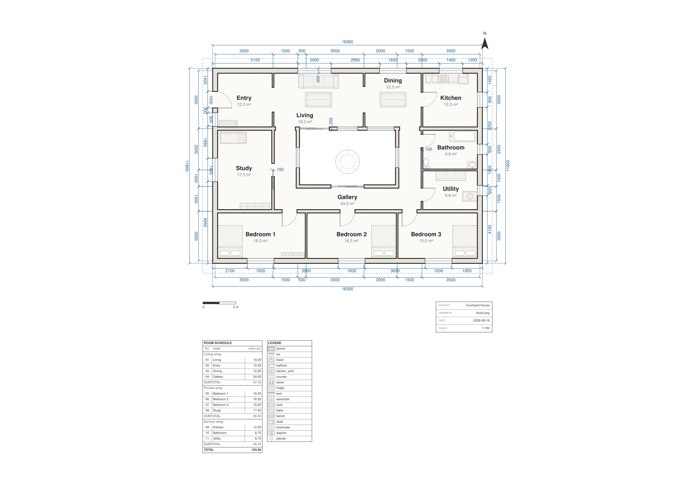</a><br/>
<b><a href="examples/courtyard-house.arch">courtyard-house</a></b><br/>
<sub>A ring of rooms round an open court —<br/>the case where a window's outward face is<br/><i>not</i> the side its bounding box suggests.</sub>
</td>
<td width="33%" align="center" valign="top">
<a href="https://playground.archlang.uk/#z=7VrNbhvJEb7zKQrUwRJAMUPKkm0tdJBlZa3ElhYWEyEIArE5U-T0atg9290jilkEyEPkCfMkQVX1_JCSZTtr5BQfDIns-bq66quqr3q0A6dwODyEBxiNYAkhd4j7PliHawjonEoRclt5hH__819gDULm1EqbBZToQBYOYO7sEqYF3mMxhVlh0zs_7O30duB0C0R7CDnCrNJFRiBhXSKEXAWwpljDUt2hB4-GlhrwmAZtzQCUyRp47Xs7kNsVKCgLZcCrtQdvh3Cu0lw2p22UAesybZRby7qZzdYMNMPULtGDDh7sykCpFnjc24GpcmkOqV2WusAprJwO6CHYlWHbhx9GQ3-_GHQ_GT_65EA-USYjxAx96vQMYX__Z2_NFBbOrjyoeBj_179Nh3B-j24dcnKHrYLXGYqP2I3s9mlldPDTAUwXTmfTAUGXqkRHH_lUFUg_ZHrpQVXBTvkh7cEHFTADa1Lkk6uyLDSfCZA2beI3w1RReKzB3k4bHe1Be18xBMfe54gBOFoIvLGEefL-HK4npxef4OIari7P4ertH87PJnDz6WIyOb-EyftP5-cwufh4fj2Ei8yDcgiV0b9UCDcXk_cXl6CAXTIAb_n4Xi3JlqnOTnyYkgGqKISf0WwyDowNoCAtlM_l1KHmWIZpoZwiAgnDQo4eeWc5ps_VPAxhQt95bRYFwlyl_PyKPhMyElRVEtnnhbXOQ4ELVRzT52vI1T2CscR_EyCz1vV2wM7pS-2IXDV1tQlT8EEXBThUmcDOtfNhn2GhUIZdrjwtSHPMJKkiIyjkdZAaVu3uDe_RBZ2qYgqpNQbTQLSm-LILJY1nWNjVEM5yZRYokeMvXnjQxFKycG0rWGCA6c0tx_H2T5cfTydn78_fTcGpkKMjHxpQ4HWBJhRryLSPe5KtdAjhwjTTjrI0BgCzTqXgvWLUMkythOdYvFHoRR7AVcaDKizRL3iYWxtKp014QWn_4eryR1AP2ke_ZtpBVfJuaALSZhxoFXjVCw-Fcgt0-6mVYhAQ0GRDeI9Osow2Ih88MNdh3fBv4WxlshidaFtnGw4Op6lK72LIISeKkmFpoZczMjjYlXJZjIZDDD805G6PBsxQhGBLcSSkyjlKVD5gZldmOugckHBzBFuW1uv6RExjqnuFt8JfWmPUPVDNiKyjDFFUFoidMx9cRYxJtUurgkPR25HKsMrJQfiQYhk4DmiCWwNmCxzAKtdpLmmy7obOB1t6GA1Hh7AEn1sXaseQk3o7sFJFUSdccLqsU5Vrv7NVwNavbUrVdL7TIc0xphTRWLbt7UCBZhFymFeOmeptFXLKgyUqX5HPDg4TWC7JGqptxL0ySL04SJLa_bWvBqAWShsfQPV24FWSwFIbvayWzI2Yyw7nlUeJLLeXlQ45pc9Pp5P3t5Orq9vL00-frm6mQ_ho77nVtY7iFiYV4GHAybDSGRrOfz7yMX0oHUFsE-dQeMGoJWaABS7RcKrzs5J7N-__wrX4p9NPk4vJxdXlNby7unwxgY9Xfz4nzyP4UhvkSFCqPJwcjJNkwHusMOw7a5fNl-uTl0dJEnsZrUid9b7z9askSYhNHI-n6rNp2V4WKsUmu27OeE-qairkvCuh8OrcrtABf-a1tBo1s_eSr5YjbKUScc32QaV3Lf-NJUaktlzvl8oHPCYrVCNDQuOCOsckLlzaaxMyp7Sh4MSvVxjYHk9luE4vVdc07WFOpw4WUqmx2guleR1lDz_MrSdVRUFJbLL4be2lZeykKyukv9Mm84DKmdhN2IEbxVgXReWDo6JGAB6Le_QS5Y3qdXNGXalE48HO56CkTo2GryhPiT1C3rowaAM6cKTI9ALVXIg3LW16h2F6zC2Gm6Ox7GvndGYdH8pQuGLWvxq-guUY0sKqO_JALNq-oC0LnIcpZE7fRyeXymABxjrKXRMIeTw8IhMpbQtl7rrc3dUBDGLm4fVhEju_yLnXSQJlUZHFP6vlbC86RLkMjbiW00-JIdospnzGjbLG4S2pIsoTKg2VKgqK9RBOgTITpQZ50sKslQysbFVQqkiaMJE0J3VQswJ_AL-qROORA3kx-BViGY_PVYIrdE1DvUTjSb-kORFS1dqM0qNREdyAsMB7kTpUQIdwaSkS-9FQjiFvRRwXrXkMUzraNdm_uzft7YDDUDnjwVRFAXProkYkIsKsCjAVtKmUwZvb65uLyx9vr95eTz796WxCSiFVhooZ3qNhrbkGDqMO5LTW3TEIPEkYUjwK3v7lp9PrayiJf-SCsLJkNXGDKuDKQnCK5LA2tUBmi-9RFZGqkQ7GRrIwTYKFUrk7LhiBK1TtYKHhVBKVZwiJv3CXCt7K1v2JKgGH-ximjio4K46mu4haYQFgfeCNX3gy-B6dJ_va0ob0FRcRalGuMsw3VdxRSVde6jn60BRK-gWdadJQTKkB6RH6lpjI-xV-2ON21J_UM0kffu0B8AQBy2UPYEfGCDhMpsedelgqFzRTSHsYS93fqvoeRtQsfD0-TOdF5fMpY871Q6gcspD1UqCHw-FhAtbRD0lC4lqmyFaMkXu1F4WSKgP4UDr0HvBBpaFYD3sA0dQeAE88cHoApXXBKR16IDMIjI55gdSOquwBNLMQxbzHBl5VgUS8StHD4WGS8MibJMkP8PJNkkBaoHIww7BCNDEjXVjLuYedQVZ7mBWaWx7jzixJD6Kc77hmpU1mV3UHbIbf2M5F3JC0qROY_NIUICIgQXenEha1PldlXS4LFYVzRiVkqbOs4MpL00OUkaGZYKSyx4gydt3TWnYS4ZGCR49F1UFtq0RbUp-l0cpQSAoMcAMncEgsif92hNyQskwttEEfV76DExglr5Ik_j6BE1Zd7ZP4ENBp9oZO7wz6-tHrny4uz2l53GgnSnaVzVA5KpdM3UH0Z7Dkhn3yTG3l-QQAToB1TAOwKXS43NQqhQx_UstEwLenZ38kQFY-DWBHF2lTB7dVvuzHHiPcYwEj6P_I7VmiJPkJ8fHsRPwIrVdatwCd5lfYTQbJHuzexP_f7dEn7_ao0XqEf2yicW5DJ7tbNPLqr7DLXmYs-YnOuLcFs7olvjwNMxKYZHBzPmlA-OdtDHbG8xiy-e5NYwVDcLR0duJuWboAUDVvDQev_450nOSBA1OoGRbQf6-Kog_tv8qjF-0j00x37tncpdDcjHkXdjb_412Iiw_Mp7jLB17b39xFALZQV6msEFT20Abq-GWLelaLpn4HdZVuIcaRKCKKyyIiJefDwasW8Y-y9nfvWJP0BbEGEKEizpb2nJ1kt8JkRn9JY0KyR3Ix5BSuROIqbGVlwJJOBBELOJBobWFG11oT244KMKZyIMBUiTcQOo7cYSEnInS4KSP50qAVkcyz7uhNO73wcuECpdUmDCLk7kE8GJUBbiAD2drbQmdthSBdI027g5taZ9Cx4lwuQa0Ud6zuaVdpNHjjwIevmwPTT-1Juudk9clfuWOuzbN1qbyvZZGWrj8ajmHZCKF6avQrLEPza0QlISRXeVwEeRaPXmxFDekNoOH_swpkQxBtn5c9H4Vey5t3DW_Gm7zp7C7coymFo5-d2A12M44QfBtK6oo8X7fd7MRsJPHoaIO-RxtmbD3pNzYevZQDfOZRfnZeOaNZ_Swx04pi09QQZdKc7zDKfc4PlkySoiMuJW2GfqSH-1uI3s4VPIU4syHYJS9uIbkG0kQUIa_tXPW3jZQ6xJCrdBNObOwivpSiugUxU57GxCchOJxdiCM65mHS67C79jApYKezWqWIPoab8-sJeFzwDceuNhk-wMGg1sl8RbSbDFhU7EVQTl1KzD0ZT-x87lEoreiqMii-BI9KnaRUhOc3AiThuHzQhRp1JrrzaPv7L5VyAd0-zUf0gqBzTUVUkDu95jrPby1JVVCFXVQxWVonRifcem3umjunbnZEEw9ATiOcZ6fHR7e5EuiaJP77GsDx6HnAudPZAr8F8M3zgDwJbyyIihGzmBPEtzdtTkzogcjgeD1BLwSkJowOk8H4KEn25Nk31PHIRXIt3AORD6K6xtD_PZf_50TXd9Vc30dyfQfF9ZsEV_Ni4isE1wdZ26_1SkdgQSMFWugZZqNWDz2vst5ixg-OonCZye_biCrkX6uw3saLx340lp59bOC4hXteXtUGjrcMjGXk0rbk4nYp0fDxzYlczTK_-XXNxu0kTyZ0Lx07skpTmZEIeOFUmcd3RnGcrkNG56sWeSyt9LJru1tTABphQsccbSmTrhSj1Y_afcg3AXgm_BxA7eENC8YEEJmqArwcP2vB-HGf79LoW_q82eD2lsAdP68QusygCtRVCK-fVQgzzITnXATZ9i90YC6J406avbMVF8Wtrq5c5uwMPwv8qC-z_uDJOALfRIh-t1XLGFxqpIuThQUZXUPzjVwM8UVEvNcjrUxv7SNdWTjG62e61xXoGd2GM_mPOfWgMhl2LkQIdgA3ZzBDvvHTzWuyOPOLBJnJGyiJzfCRSgl5qGbRI7TJl1z96km1Uw9un8N55NnnRNMTMI043FJzG8LpGQqNnzpX91iH_x2Dxk8ZuM3Mpwm0iUy1KdT58vLwMBm8GTdtm4wbdYw7o8X91ojv0PwPoH-Nqf3Clcv_u__36v5fKQB8qLL1VwqAa1rb37hksfO5TvE3SIDr9lXjMypgyZfsX6cCPtJ7mtj6nxICbeeLZ__q7svrn2q_8JsacDzc51rwo_sYWf-4CXdD-b9qwt3AfFsTztDftRVUbP9CqTsStjcVFP3ddpWbWXuXKo9PoH6uML_evAF4GxE2GjDLv26vVfWLv_jmnBWj3OOr-vW5_AFHvYy6crznjsD8ilve-9_XY3DTw9lvQa07KPFdd9Okl1BWIb633hpCxYCv7rlvZOB7uuV-n477fRtupN0XIktQPF5_Q8vdRP4cE1__10339eHjpgtPtd1uln9T46W_Vapbb9ChwNhpS2d_xjRAf9L9A9OJvFITw_lt8O1sDf1Tl-YflFnEz-nvG_rjZHy0n7zeHx31Gf8fvf8A">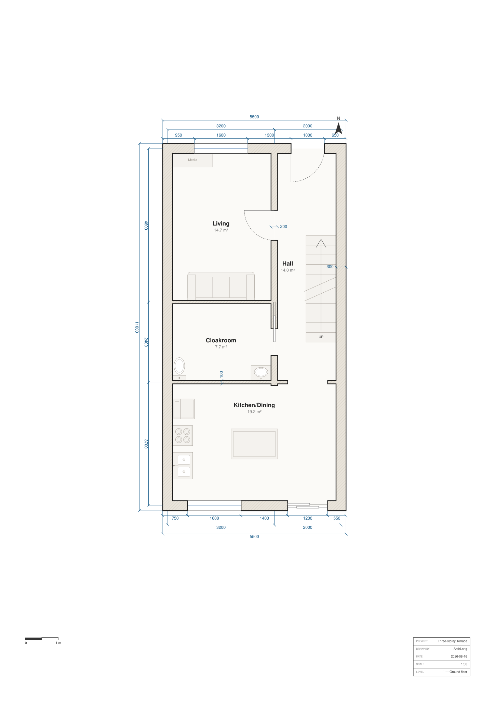</a><br/>
<b><a href="examples/townhouse.arch">townhouse</a></b><br/>
<sub>Three storeys in one file (ground floor<br/>shown) — <code>level</code> blocks, one stair<br/>shaft, one drawing per page.</sub>
</td>
</tr>
</table>

**Also in [`examples/`](examples)** — the whole corpus, by what it is there to show:

- **Start here** — [`one-room`](examples/one-room.arch) (the smallest plan that draws anything),
  [`studio`](examples/studio.arch) (the lint-clean flagship),
  [`attached`](examples/attached.arch) (nothing positioned by hand).
- **Homes** — [`laneway-house`](examples/laneway-house.arch),
  [`tiny-house`](examples/tiny-house.arch), [`garden-loft`](examples/garden-loft.arch),
  [`two-bed`](examples/two-bed.arch), [`bungalow`](examples/bungalow.arch),
  [`courtyard-house`](examples/courtyard-house.arch),
  [`townhouse`](examples/townhouse.arch) (three storeys),
  [`terrace-row`](examples/terrace-row.arch) (one component, placed four times),
  [`two-storey`](examples/two-storey.arch), [`accessible`](examples/accessible.arch)
  (`accTitle`/`accDescr`).
- **Public buildings** — [`library`](examples/library.arch),
  [`transit-hall`](examples/transit-hall.arch), [`clinic`](examples/clinic.arch),
  [`museum`](examples/museum.arch) (A1 at 1:200),
  [`hexagon-pavilion`](examples/hexagon-pavilion.arch).
- **Geometry & experiments** — [`gallery-l`](examples/gallery-l.arch) (polygon rooms),
  [`aquarium`](examples/aquarium.arch) (arcs and circles).
- **Scripting & composition** — [`parametric`](examples/parametric.arch) (a `for` loop that
  generates units), [`relational`](examples/relational.arch) (`right-of` / `below`),
  [`imports`](examples/imports.arch), [`museum-wing`](examples/museum-wing.arch) +
  [`museum-wings`](examples/museum-wings.arch) (one wing, imported and placed twice).
- **Style** — [`themed`](examples/themed.arch) (a custom theme + brick hatch),
  [`materials`](examples/materials.arch) (per-element `style` overrides and wall materials).

The [docs gallery](https://archlang.uk/examples) renders all of them **live and
editable** in the browser.

## 🏗️ How it works

ArchLang is a compiler pipeline. Source text becomes a backend-neutral **Scene IR**, and every
backend is a pure serializer of that scene — which is why adding a format never touches the language.

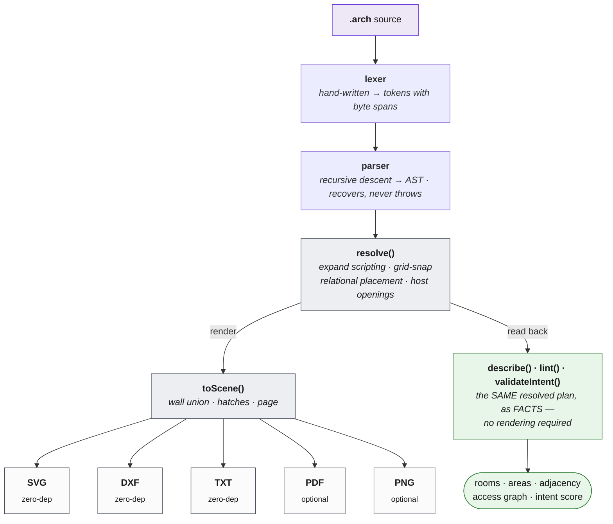
```mermaid
flowchart TD
    SRC["<b>.arch</b> source"] --> LEX["<b>lexer</b><br/><i>hand-written → tokens with byte spans</i>"]
    LEX --> PAR["<b>parser</b><br/><i>recursive descent → AST · recovers, never throws</i>"]
    PAR --> IR["<b>resolve()</b><br/><i>expand scripting · grid-snap<br/>relational placement · host openings</i>"]

    IR -->|"render"| SCN["<b>toScene()</b><br/><i>wall union · hatches · page</i>"]
    IR -->|"read back"| DESC["<b>describe() · lint() · validateIntent()</b><br/><i>the SAME resolved plan, as FACTS —<br/>no rendering required</i>"]

    SCN --> SVG["<b>SVG</b><br/><sub>zero-dep</sub>"]
    SCN --> DXF["<b>DXF</b><br/><sub>zero-dep</sub>"]
    SCN --> TXT["<b>TXT</b><br/><sub>zero-dep</sub>"]
    SCN --> PDF["<b>PDF</b><br/><sub>optional</sub>"]
    SCN --> PNG["<b>PNG</b><br/><sub>optional</sub>"]

    DESC --> FACTS(["rooms · areas · adjacency<br/>access graph · intent score"])

    style SRC fill:#ede7f6,stroke:#6b3ae0,color:#1a1a1a
    style IR fill:#eceef2,stroke:#464d59,color:#1a1a1a
    style SCN fill:#eceef2,stroke:#464d59,color:#1a1a1a
    style DESC fill:#e8f5e9,stroke:#2e7d32,color:#1a1a1a
    style FACTS fill:#e8f5e9,stroke:#2e7d32,color:#1a1a1a
    style SVG fill:#fbfbfc,stroke:#464d59,color:#1a1a1a
    style DXF fill:#fbfbfc,stroke:#464d59,color:#1a1a1a
    style TXT fill:#fbfbfc,stroke:#464d59,color:#1a1a1a
    style PDF fill:#fbfbfc,stroke:#8a8f98,color:#1a1a1a
    style PNG fill:#fbfbfc,stroke:#8a8f98,color:#1a1a1a
```

The dotted branch is the point: **`describe`, `lint` and the intent check read the same resolved
plan the renderer does** — so what an agent verifies is exactly what gets drawn, and it costs no
pixels to check.

`compile()` is **pure, synchronous and deterministic** — no I/O, no `Date.now()`, no `Math.random()`.
The only place Node APIs are allowed is the CLI; everything else gets its environment through a
`World` seam. See [AGENTS.md](AGENTS.md) and the [ADRs](docs/adr).

## 📦 Ecosystem

| Package / surface | What it is |
|---|---|
| **[`@chanmeng666/archlang`](https://www.npmjs.com/package/@chanmeng666/archlang)** | The core: compiler, CLI, analysis. Zero runtime deps, isomorphic. |
| **[`@chanmeng666/archlang-mcp`](packages/mcp)** | Optional stdio MCP server (the SDK is quarantined here). |
| **[VS Code extension](https://marketplace.visualstudio.com/items?itemName=ChanMeng.archlang)** | Syntax + live diagnostics, hover, completion, rename. |
| **[Playground](https://playground.archlang.uk)** | Client-side editor: preview, describe, lint, **intent scoring**, apply-fix, embed. |
| **[Docs site](https://archlang.uk)** | Guide, reference, [CLI reference](https://archlang.uk/cli), ADRs, live examples. |
| **[🤗 Dataset](https://huggingface.co/datasets/ChanMeng666/archlang-repair-trajectories)** | Synthetic, self-verifying **repair trajectories** + authoring pairs. CC0. |
| **[GitHub Action](.github/actions/arch-render)** | Render ` ```arch ` fences in any repo's Markdown. |

### Embed a plan anywhere

A **live, editable** plan in any blog, wiki or docs page — one `<iframe>`, no build step, nothing
sent to a server (the source rides in the compressed `#z=` hash, so the page is self-contained):

```html
<iframe src="https://playground.archlang.uk/embed.html#z=…" width="720" height="480"></iframe>
```

The playground's **Embed** button generates the snippet. Optional params: `editable=1` (show a
compact editor that re-renders as you type) and `theme=blueprint|dark|mono|presentation`.

> **Not on GitHub, though.** GitHub's markdown sanitizer strips `<iframe>` — it renders as escaped
> text, the same way `<script>` does — so a README (here or anywhere on github.com) *cannot* host a
> live embed, no matter how it's written. The honest substitutes GitHub does allow are what this
> README uses: a **static SVG the compiler really produced**, linked to a **playground permalink
> that opens the same plan live**. On the [docs site](https://archlang.uk/examples),
> where the sanitizer doesn't apply, every plan *is* live and editable in place.

## 📚 Documentation

- **[📖 Docs site](https://archlang.uk)** — guide, reference, error catalog, ADRs, and a **live, editable** examples gallery. Every ` ```arch ` fence on a docs page is itself an editable plan.
- **[⌨ CLI reference](https://archlang.uk/cli)** — every command, flag and exit code (generated from the manifest, so it can't fall behind).
- **[spec.llm.md](spec.llm.md)** — the **whole language in one page** (~2k tokens) for AI agents; also `arch spec`.
- **[SKILL.md](SKILL.md)** — the agent Skill: the `spec → compile → fix → describe → validate` loop.
- **[Language Reference](docs/language-reference.md)** · **[Error catalog](docs/error-codes.md)** · **[The intent contract](docs/intent.md)** · **[ADRs](docs/adr)**
- **[AGENTS.md](AGENTS.md)** — orientation for AI agents working *in* this repo.

## 🤝 Contributing

Contributions are welcome! Please read the [Contributing Guide](CONTRIBUTING.md) and our
[Code of Conduct](CODE_OF_CONDUCT.md). Use the issue and pull-request templates when you open one.

## ❤️ Support & Sponsor

- Questions? Open a [Discussion](https://github.com/chanmeng666/archlang/discussions) or see [SUPPORT.md](SUPPORT.md).
- Found a security issue? Follow [SECURITY.md](SECURITY.md).
- If this project helps you, consider [sponsoring](https://github.com/sponsors/ChanMeng666) ☕.

## 📄 License

Released under the [MIT](LICENSE) license.

---

<!-- CHAN MENG PERSONAL BRAND -->
<div align="center">
  <a href="https://github.com/ChanMeng666" target="_blank">
    
  </a>

  <p><strong>Chan Meng</strong><br/>Need a custom app like this one? I build them — let's talk.</p>

  <a href="mailto:chanmeng.dev@gmail.com"></a>
  <a href="https://github.com/ChanMeng666"></a>
</div>
<!-- /CHAN MENG PERSONAL BRAND -->
